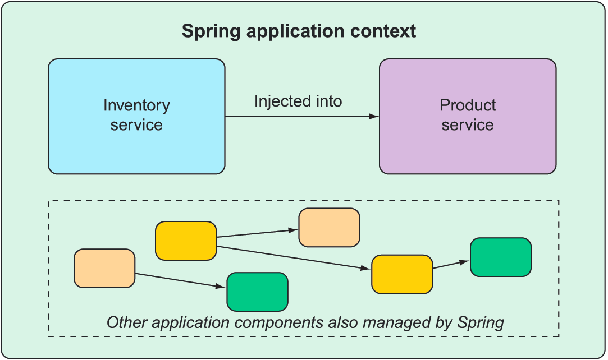

# 1. Getting started with Spring

> **This chapter covers**
>
>- <small>Spring and Spring Boot essentials
>- Initializing a Spring project
>- An overview of the Spring landscape</samll>

### What is spring?

At its core, Spring offers a **container**, often referred to as the **Spring application context**, that creates and
manages application components. These components, or **beans**, are wired together inside the Spring application context
to make a complete application, much like bricks, mortar, timber, nails, plumbing, and wiring are bound together to make
a house.

The act of wiring beans together is based on a pattern known as **dependency injection (DI)**. Rather than have
components create and maintain the lifecycle of other beans that they depend on, a dependency-injected application
relies on a separate entity (the container) to create and maintain all components and inject those into the beans that
need them. This is done typically through constructor arguments or property accessor methods.



For example, the following XML declares two beans, an InventoryService bean and a ProductService bean, and wires the
<kbd>InventoryService</kbd> bean into <kbd>ProductService</kbd> via a constructor argument:

```xml

<bean id="inventoryService"
      class="com.example.InventoryService"/>

<bean id="productService"
      class="com.example.ProductService"/>
<constructor-arg ref="inventoryService"/>
        </bean>
```

In recent versions of Spring, however, a Java-based configuration is more common. The following Java-based configuration
class is equivalent to the XML configuration:

```java

@Configuration
public class ServiceConfiguration {
    @Bean
    public InventoryService inventoryService() {
        return new InventoryService();
    }

    @Bean
    public ProductService productService() {
        return new ProductService(inventoryService());
    }
}
```

The <kbd>@Configuration</kbd> annotation indicates to Spring that this is a configuration class that will provide beans
to the Spring application context. The configuration’s class methods are annotated with @Bean, indicating that the
objects they return should be added as beans in the application context (where, by default, their respective bean IDs
will be the same as the names of the methods that define them).

Automatic configuration has its roots in the Spring techniques known as **autowiring** and **component scanning**. With
component scanning, Spring can automatically discover components from an application’s classpath and create them as
beans in the Spring application context. With autowiring, Spring automatically injects the components with the other
beans that they depend on.

### Examining the Spring project structure

#### Bootstrapping the application

```java
package tacos;

import org.springframework.boot.SpringApplication;
import org.springframework.boot.autoconfigure.SpringBootApplication;

@SpringBootApplication
public class TacoCloudApplication {

    public static void main(String[] args) {
        SpringApplication.run(TacoCloudApplication.class, args);
    }

}
```

Although there’s little code in <kbd>TacoCloudApplication</kbd>, what’s there packs quite a punch. One of the most
powerful lines of code is also one of the shortest. The <kbd>@SpringBootApplication</kbd> annotation clearly signifies
that this is a Spring Boot application. But there’s more to @SpringBootApplication than meets the eye.

<kbd>@SpringBootApplication</kbd> is a composite annotation that combines three other annotations:

<kbd>@SpringBootConfiguration</kbd> — Designates this class as a configuration class. Although there’s not much
configuration in the class yet, you can add Java-based Spring Framework configuration to this class if you need to. This
annotation is, in fact, a specialized form of the <kbd>@Configuration</kbd> annotation.

<kbd>@EnableAutoConfiguration</kbd> — Enables Spring Boot automatic configuration. We’ll talk more about
autoconfiguration later. For now, know that this annotation tells Spring Boot to automatically configure any components
that it thinks you’ll need.
<kbd>@ComponentScan</kbd> — Enables component scanning. This lets you declare other classes with annotations like <kbd>
@Component</kbd>,
<kbd>@Controller</kbd>, <kbd>@Service</kbd>, and others, to have Spring automatically discover them and register them as
components in the Spring application context.

The other important piece of <kbd>TacoCloudApplication</kbd> is the <kbd>main()</kbd> method. This is the method that
will be run when the JAR file is executed. For the most part, this method is boilerplate code; every Spring Boot
application you write will have a method similar or identical to this one (class name differences notwithstanding).

#### Testing the controller

```java
package tacos;

import static org.hamcrest.Matchers.containsString;
import static org.springframework.test.web.servlet.request.MockMvcRequestBuilders.get;
import static org.springframework.test.web.servlet.result.MockMvcResultMatchers.content;
import static org.springframework.test.web.servlet.result.MockMvcResultMatchers.status;
import static org.springframework.test.web.servlet.result.MockMvcResultMatchers.view;

import org.junit.jupiter.api.Test;
import org.springframework.beans.factory.annotation.Autowired;
import org.springframework.boot.test.autoconfigure.web.servlet.WebMvcTest;
import org.springframework.test.web.servlet.MockMvc;

@WebMvcTest(HomeController.class)
public class HomeControllerTest {

    @Autowired
    private MockMvc mockMvc;

    @Test
    public void testHomePage() throws Exception {
        mockMvc.perform(get("/"))
                .andExpect(status().isOk())
                .andExpect(view().name("home"))
                .andExpect(content().string(
                        containsString("Welcome to...")));
    }

}
```

The first thing you might notice about this test is that it differs slightly from the <kbd>
TacoCloudApplicationTests</kbd>
class with regard to the annotations applied to it. Instead of <kbd>@SpringBootTest</kbd> markup, HomeControllerTest is
annotated with
<kbd>@WebMvcTest</kbd>. This is a special test annotation provided by Spring Boot that arranges for the test to run in
the context of a Spring MVC application. More specifically, in this case, it arranges for HomeController to be
registered in Spring MVC so that you can throw requests against it.

<kbd>@WebMvcTest</kbd> also sets up Spring support for testing Spring MVC. Although it could be made to start a server,
mocking the mechanics of Spring MVC is sufficient for your purposes. The test class is injected with a MockMvc object
for the test to drive the mockup.

The <kbd>testHomePage()</kbd> method defines the test you want to perform against the homepage. It starts with
the </kbd>MockMvc</kbd> object to perform an HTTP GET request for / (the root path). From that request, it sets the
following expectations:

The response should have an HTTP 200 (OK) status. The view should have a logical name of home. The rendered view should
contain the text “Welcome to….” If, after the MockMvc object performs the request, any of those expectations aren’t met,
then the test fails. But your controller and view template are written to satisfy those expectations, so the test should
pass with flying colors—or at least with some shade of green indicating a passing test

#### Summary

- Spring aims to make developer challenges easy, like creating web applications, working with databases, securing
  applications, and microservices.

- Spring Boot builds on top of Spring to make Spring even easier with simplified dependency management, automatic
  configuration, and runtime insights.

- Spring applications can be initialized using the Spring Initializr, which is web-based and supported natively in most
  Java development environments.

- The components, commonly referred to as beans, in a Spring application context can be declared explicitly with Java or
  XML, discovered by component scanning, or automatically configured with Spring Boot autoconfiguration.