# 10.Introducing Reactor

> **This chapter covers**
>- Understanding reactive programming
>- Project Reactor
>- Operating on data reactively

- *Imperative* code is a lot like that absurd hypothetical newspaper subscription. It’s a serial set of tasks, each
  running one at a time, each after the previous task. Data is processed in bulk and can’t be handed over to the next
  task until the previous task has completed its work on the bulk of data.
- *Reactive* code is a lot like a real newspaper subscription. A set of tasks is defined to process data, but those
  tasks can run in parallel. Each task can process subsets of the data, handing it off to the next task in line while it
  continues to work on another subset of the data.

### Understanding reactive programming

- A water balloon carries its payload all at once, soaking its intended target at the moment of impact. The water
  balloon has a finite capacity, however, and if you wish to soak more people (or the same person to a greater extent),
  your only choice is to scale up by increasing the number of water balloons.
- A garden hose carries its payload as a stream of water that flows from the spigot to the nozzle. The garden hose’s
  capacity may be finite at any given point in time, but it’s unlimited over the course of a water battle. As long as
  water is entering the hose from the spigot, it will continue to flow through the hose and spray out of the nozzle. The
  same garden hose is easily scalable to soak as many friends as you wish.

#### Defining Reactive Streams

The Reactive Streams specification can be summed up by four interface definitions: `Publisher`, `Subscriber`
, `Subscription`, and `Processor`. A `Publisher` produces data that it sends to a `Subscriber` per a `Subscription`. The
Publisher interface declares a single method, `subscribe()`, through which a `Subscriber` can subscribe to
the `Publisher`:

```java
public interface Publisher<T> {
    void subscribe(Subscriber<? super T> subscriber);
}
```

Once a `Subscriber` has subscribed, it can receive events from the `Publisher`. Those events are sent via methods on the
`Subscriber` interface:

```java
public interface Subscriber<T> {
    void onSubscribe(Subscription sub);

    void onNext(T item);

    void onError(Throwable ex);

    void onComplete();
}
```

The first event that the `Subscriber` will receive is through a call to `onSubscribe()`. When the `Publisher` calls
`onSubscribe()`, it passes a `Subscription` object to the `Subscriber`. It’s through the `Subscription` that
the `Subscriber` can manage its subscription:

```java
public interface Subscription {
    void request(long n);

    void cancel();
}
```

As for the Processor interface, it’s a combination of Subscriber and Publisher, as shown here:

```java
  public interface Processor<T, R>
        extends Subscriber<T>, Publisher<R> {
}
```

### Getting started with Reactor

Reactive programming requires us to think in a very different way from imperative programming. Rather than describe a
set of steps to be taken, reactive programming means building a pipeline through which data will flow. As data passes
through the pipeline, it can be altered or used in some way.

```java
class Mono {
    public void mono() {
        Mono.just("Craig")
                .map(n -> n.toUpperCase())
                .map(cn -> "Hello, " + cn + "!")
                .subscribe(System.out::println);
    }
}
```

The `Mono` in the example is one of Reactor’s two core types. `Flux` is the other. Both are implementations of Reactive
Streams’ `Publisher`. A `Flux` represents a pipeline of zero, one, or many (potentially infinite) data items. A `Mono`
is a specialized reactive type that’s optimized for when the dataset is known to have no more than one data item.

#### Diagramming reactive flows

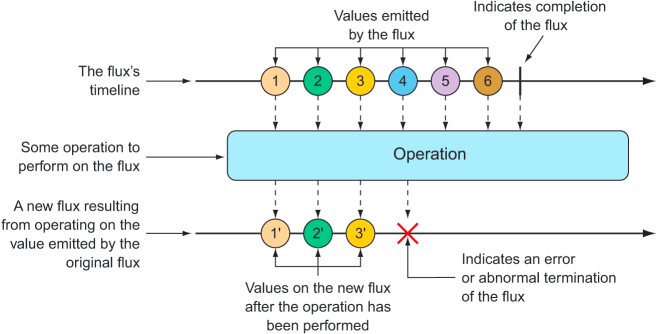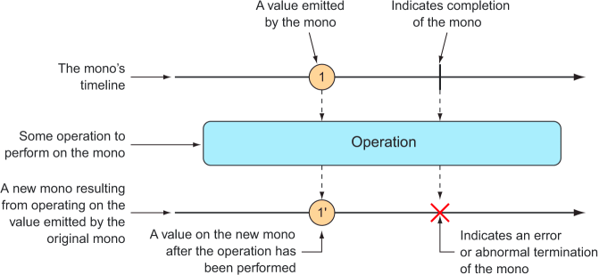

#### Adding Reactor dependencies

To get started with Reactor, add the following dependency to the project build:

```xml

<dependency>
    <groupId>io.projectreactor</groupId>
    <artifactId>reactor-core</artifactId>
</dependency>
```

Reactor also provides some great testing support. You’re going to write a lot of tests around your Reactor code, so
you’ll definitely want to add this dependency to your build:

```xml

<dependency>
    <groupId>io.projectreactor</groupId>
    <artifactId>reactor-test</artifactId>
    <scope>test</scope>
</dependency>

```

I’m assuming that you’re adding these dependencies to a Spring Boot project, which handles dependency management for
you, so there’s no need to specify the <version> element for the dependencies. But if you want to use Reactor in a
non-Spring Boot project, you’ll need to set up Reactor’s BOM (bill of materials) in the build. The following dependency
management entry adds Reactor’s Bismuth release to the build:

```xml

<dependencyManagement>
    <dependencies>
        <dependency>
            <groupId>io.projectreactor</groupId>
            <artifactId>reactor-bom</artifactId>
            <version>Bismuth-RELEASE</version>
            <type>pom</type>
            <scope>import</scope>
        </dependency>
    </dependencies>
</dependencyManagement>
```

### Applying common reactive operations

`Flux` and `Mono` are the most essential building blocks provided by Reactor, and the operations those two reactive
types offer are the mortar that binds them together to create pipelines through which data can flow. Between `Flux` and
`Mono`, there are over 500 operations, each of which can be loosely categorized as

- Creation operations
- Combination operations
- Transformation operations
- Logic operations

#### Creating reactive types

##### CREATING FROM OBJECTS

```java
package com.taco.cloud;

import org.junit.jupiter.api.Test;
import org.springframework.boot.test.context.SpringBootTest;
import reactor.core.publisher.Flux;
import reactor.test.StepVerifier;

@SpringBootTest
public class ReactiveTest {


    @Test
    public void test() {
        Flux<String> fruitFlux = Flux.just("Apple", "Orange", "Grape", "Banana", "Strawberry");

        fruitFlux.subscribe(f -> {
            System.out.println("Here's some fruit: " + f);
        });

        StepVerifier.create(fruitFlux)
                .expectNext("Apple")
                .expectNext("Orange")
                .expectNext("Grape")
                .expectNext("Banana")
                .expectNext("Strawberry")
                .verifyComplete();
    }
}
```

##### CREATING FROM COLLECTIONS

A Flux can also be created from an array, Iterable, or Java Stream. Figure 10.3 illustrates how this works with a marble
diagram.

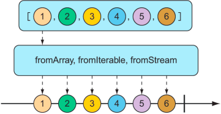

To create a Flux from an array, call the static `fromArray()` method, passing in the source array:

```java
class Test {
    @Test
    public void createAFlux_fromArray() {
        String[] fruits = new String[]{
                "Apple", "Orange", "Grape", "Banana", "Strawberry"};
        Flux<String> fruitFlux = Flux.fromArray(fruits);
        StepVerifier.create(fruitFlux)
                .expectNext("Apple")
                .expectNext("Orange")
                .expectNext("Grape")
                .expectNext("Banana")
                .expectNext("Strawberry")
                .verifyComplete();
    }
}
```

If you need to create a Flux from a `java.util.List`, `java.util.Set`, or any other implementation
of `java.lang.Iterable`, you can pass it into the static `fromIterable()` method:

```java
class Test {
    @Test
    public void createAFlux_fromIterable() {
        List<String> fruitList = new ArrayList<>();
        fruitList.add("Apple");
        fruitList.add("Orange");
        fruitList.add("Grape");
        fruitList.add("Banana");
        fruitList.add("Strawberry");
        Flux<String> fruitFlux = Flux.fromIterable(fruitList);
        // ... verify steps
    }
}
```

Or, if you happen to have a Java Stream that you’d like to use as the source for a Flux, `fromStream()` is the method
you’ll use:

```java
class Test {
    @Test
    public void createAFlux_fromStream() {
        Stream<String> fruitStream =
                Stream.of("Apple", "Orange", "Grape", "Banana", "Strawberry");
        Flux<String> fruitFlux = Flux.fromStream(fruitStream);
        // ... verify steps
    }
}
```

##### GENERATING FLUX DATA

Sometimes you don’t have any data to work with and just need Flux to act as a counter, emitting a number that increments
with each new value. To create a counter `Flux`, you can use the static `range()` method. The diagram in figure 10.4
illustrates how `range()` works.

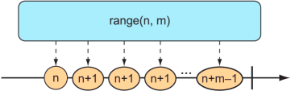

The following test method demonstrates how to create a range Flux:

```java
class Test {
    @Test
    public void createAFlux_range() {
        Flux<Integer> intervalFlux =
                Flux.range(1, 5);

        StepVerifier.create(intervalFlux)
                .expectNext(1)
                .expectNext(2)
                .expectNext(3)
                .expectNext(4)
                .expectNext(5)
                .verifyComplete();
    }
}
```

Another Flux-creation method that’s similar to range() is `interval()`. Like the `range()` method, `interval()` creates
a Flux that emits an incrementing value. But what makes `interval()` special is that instead of you giving it a starting
and ending value, you specify a duration or how often a value should be emitted. Figure 10.5 shows a marble diagram for
the
`interval()` creation method.
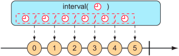

```java
class Test {
    @Test
    public void createAFlux_interval() {
        Flux<Long> intervalFlux =
                Flux.interval(Duration.ofSeconds(1))
                        .take(5);

        StepVerifier.create(intervalFlux)
                .expectNext(0L)
                .expectNext(1L)
                .expectNext(2L)
                .expectNext(3L)
                .expectNext(4L)
                .verifyComplete();
    }
}
```

Notice that the value emitted by an interval Flux starts with 0 and increments on each successive item. Also, because
`interval()` isn’t given a maximum value, it will potentially run forever. Therefore, you also use the `take()`
operation to limit the results to the first five entries. We’ll talk more about the `take()` operation in the next
section.

### Combining reactive types

#### MERGING REACTIVE TYPES

Suppose you have two `Flux` streams and need to create a single resulting `Flux` that will produce data as it becomes
available from either of the upstream `Flux` streams. To merge one `Flux` with another, you can use the `mergeWith()`
operation, as illustrated with the marble diagram in figure 10.6.

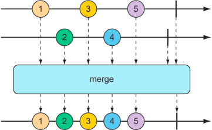

```java
class Test {
    @Test
    public void mergeFluxes() {
        Flux<String> characterFlux = Flux
                .just("Garfield", "Kojak", "Barbossa")
                .delayElements(Duration.ofMillis(500));
        Flux<String> foodFlux = Flux
                .just("Lasagna", "Lollipops", "Apples")
                .delaySubscription(Duration.ofMillis(250))
                .delayElements(Duration.ofMillis(500));
        Flux<String> mergedFlux = characterFlux.mergeWith(foodFlux);
        StepVerifier.create(mergedFlux)
                .expectNext("Garfield")
                .expectNext("Lasagna")
                .expectNext("Kojak")
                .expectNext("Lollipops")
                .expectNext("Barbossa")
                .expectNext("Apples")
                .verifyComplete();
    }
}
```

Normally, a Flux will publish data as quickly as it possibly can. Therefore, you use a `delayElements()` operation on
both of the created Flux streams to slow them down a little—only emitting an entry every 500 ms. Furthermore, so that
the food `Flux` starts streaming after the character Flux, you apply a `delaySubscription()` operation to the
food `Flux` so that it won’t emit any data until 250 ms have passed following a subscription.

Because `mergeWith()` can’t guarantee a perfect back and forth between its sources, you may want to consider the `zip()`
operation instead. When two Flux objects are zipped together, it results in a new Flux that produces a tuple of items,
where the tuple contains one item from each source Flux. Figure 10.7 illustrates how two Flux objects can be zipped
together.
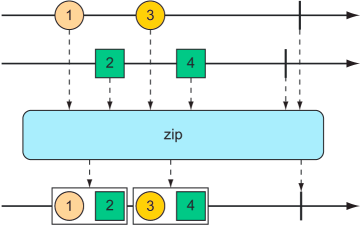

```java
class Test {
    @Test
    public void zipFluxes() {
        Flux<String> characterFlux = Flux
                .just("Garfield", "Kojak", "Barbossa");
        Flux<String> foodFlux = Flux
                .just("Lasagna", "Lollipops", "Apples");
        Flux<Tuple2<String, String>> zippedFlux =
                Flux.zip(characterFlux, foodFlux);
        StepVerifier.create(zippedFlux)
                .expectNextMatches(p ->
                        p.getT1().equals("Garfield") &&
                                p.getT2().equals("Lasagna"))
                .expectNextMatches(p ->
                        p.getT1().equals("Kojak") &&
                                p.getT2().equals("Lollipops"))
                .expectNextMatches(p ->
                        p.getT1().equals("Barbossa") &&
                                p.getT2().equals("Apples"))
                .verifyComplete();
    }
}
```

Notice that unlike `mergeWith()`, the `zip()` operation is a static creation operation. The created `Flux` has a perfect
alignment between characters and their favorite foods. Each item emitted from the zipped Flux is a `Tuple2` (a container
object that carries two other objects) containing items from each source `Flux`, in the order that they’re published. If
you’d rather not work with a `Tuple2` and would rather work with some other type, you can provide a Function to `zip()`
that produces any object you’d like, given the two items (as shown in the marble diagram in figure 10.8).

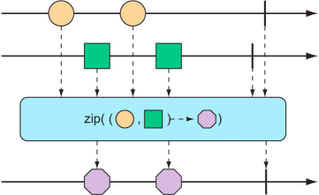

For example, the following test method shows how to zip the character Flux with the food Flux so that it results in a
Flux of String objects:

```java
class Test {
    @Test
    public void zipFluxesToObject() {
        Flux<String> characterFlux = Flux
                .just("Garfield", "Kojak", "Barbossa");
        Flux<String> foodFlux = Flux
                .just("Lasagna", "Lollipops", "Apples");
        Flux<String> zippedFlux =
                Flux.zip(characterFlux, foodFlux, (c, f) -> c + " eats " + f);
        StepVerifier.create(zippedFlux)
                .expectNext("Garfield eats Lasagna")
                .expectNext("Kojak eats Lollipops")
                .expectNext("Barbossa eats Apples")
                .verifyComplete();
    }
}
```

#### SELECTING THE FIRST REACTIVE TYPE TO PUBLISH

Suppose you have two Flux objects, and rather than merge them together, you merely want to create a new Flux that emits
the values from the first Flux that produces a value. As shown in figure 10.9, the `first()` operation picks the first
of two Flux objects and echoes the values it publishes.
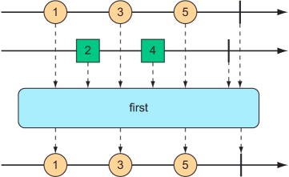

```java
class Test {
    @Test
    public void firstFlux() {
        Flux<String> slowFlux = Flux.just("tortoise", "snail", "sloth")
                .delaySubscription(Duration.ofMillis(100));
        Flux<String> fastFlux = Flux.just("hare", "cheetah", "squirrel");
        Flux<String> firstFlux = Flux.first(slowFlux, fastFlux);
        StepVerifier.create(firstFlux)
                .expectNext("hare")
                .expectNext("cheetah")
                .expectNext("squirrel")
                .verifyComplete();
    }
}
```

In this case, because the slow Flux won’t publish any values until 100 ms after the fast Flux has started publishing,
the newly created `Flux` will simply ignore the slow `Flux` and only publish values from the fast `Flux`.

### Transforming and filtering reactive streams

As data flows through a stream, you’ll likely need to filter out some values and modify other values. In this section,
we’ll look at operations that transform and filter the data flowing through a reactive stream.

#### FILTERING DATA FROM REACTIVE TYPES

One of the most basic ways of filtering data as it flows from a Flux is to simply disregard the first so many entries.
The `skip()` operation, illustrated in figure 10.10, does exactly that.

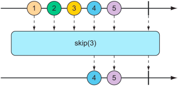

```java
class Test {
    @Test
    public void skipAFew() {
        Flux<String> skipFlux = Flux.just(
                        "one", "two", "skip a few", "ninety nine", "one hundred")
                .skip(3);
        StepVerifier.create(skipFlux)
                .expectNext("ninety nine", "one hundred")
                .verifyComplete();
    }
}
```

But maybe you don’t want to skip a specific number of items, but instead need to skip the first so many items until some
duration has passed. An alternate form of the `skip()` operation, illustrated in figure 10.11, produces a Flux that
waits until some specified time has passed before emitting items from the source Flux.
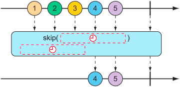
The test method that follows uses `skip()` to create a Flux that waits four seconds before emitting any values. Because
that `Flux` was created from a `Flux` that has a one-second delay between items (using `delayElements()`), only the last
two items will be emitted:

```java
class Test {
    @Test
    public void skipAFewSeconds() {
        Flux<String> skipFlux = Flux.just(
                        "one", "two", "skip a few", "ninety nine", "one hundred")
                .delayElements(Duration.ofSeconds(1))
                .skip(Duration.ofSeconds(4));
        StepVerifier.create(skipFlux)
                .expectNext("ninety nine", "one hundred")
                .verifyComplete();
    }
}
```

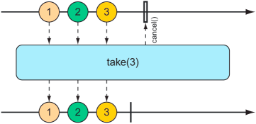

```java
class Test {
    @Test
    public void take() {
        Flux<String> nationalParkFlux = Flux.just(
                        "Yellowstone", "Yosemite", "Grand Canyon",
                        "Zion", "Grand Teton")
                .take(3);
        StepVerifier.create(nationalParkFlux)
                .expectNext("Yellowstone", "Yosemite", "Grand Canyon")
                .verifyComplete();
    }
}
```

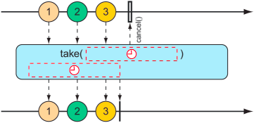

```java
class Test {
    @Test
    public void take() {
        Flux<String> nationalParkFlux = Flux.just(
                        "Yellowstone", "Yosemite", "Grand Canyon",
                        "Zion", "Grand Teton")
                .delayElements(Duration.ofSeconds(1))
                .take(Duration.ofMillis(3500));
        StepVerifier.create(nationalParkFlux)
                .expectNext("Yellowstone", "Yosemite", "Grand Canyon")
                .verifyComplete();
    }
}
```

The `skip()` and `take()` operations can be thought of as filter operations where the filter criteria are based on a
count or a duration. For more general-purpose filtering of Flux values, you’ll find the `filter()` operation quite
useful.

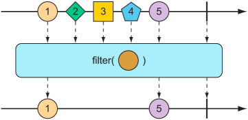

```java
class Test {
    @Test
    public void filter() {
        Flux<String> nationalParkFlux = Flux.just(
                        "Yellowstone", "Yosemite", "Grand Canyon",
                        "Zion", "Grand Teton")
                .filter(np -> !np.contains(" "));
        StepVerifier.create(nationalParkFlux)
                .expectNext("Yellowstone", "Yosemite", "Zion")
                .verifyComplete();
    }
}
```

Perhaps the filtering you need is to filter out any items that you’ve already received. The `distinct()` operation, as
illustrated in figure 10.15, results in a Flux that only publishes items from the source Flux that haven’t already been
published.

```java
class Test {
    @Test
    public void distinct() {
        Flux<String> animalFlux = Flux.just(
                        "dog", "cat", "bird", "dog", "bird", "anteater")
                .distinct();
        StepVerifier.create(animalFlux)
                .expectNext("dog", "cat", "bird", "anteater")
                .verifyComplete();
    }
}
```

#### MAPPING REACTIVE DATA

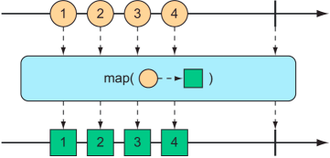

```java
class Test {
    @Test
    public void map() {
        Flux<Player> playerFlux = Flux
                .just("Michael Jordan", "Scottie Pippen", "Steve Kerr")
                .map(n -> {
                    String[] split = n.split("\\s");
                    return new Player(split[0], split[1]);
                });
        StepVerifier.create(playerFlux)
                .expectNext(new Player("Michael", "Jordan"))
                .expectNext(new Player("Scottie", "Pippen"))
                .expectNext(new Player("Steve", "Kerr"))
                .verifyComplete();
    }
}
```

What’s important to understand about `map()` is that the mapping is performed synchronously, as each item is published
by the source `Flux`. If you want to perform the mapping asynchronously, you should consider the `flatMap()` operation.

The `flatMap()` operation requires some thought and practice to acquire full proficiency. As shown in figure 10.17,
instead of simply mapping one object to another, as in the case of `map()`, `flatMap()` maps each object to a new `Mono`
or
`Flux`. The results of the `Mono` or `Flux` are flattened into a new resulting `Flux`. When used along
with `subscribeOn()`, flatMap() can unleash the asynchronous power of Reactor’s types.
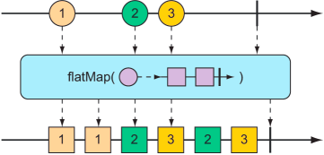

```java
class Test {
    @Test
    public void flatMap() {
        Flux<Player> playerFlux = Flux
                .just("Michael Jordan", "Scottie Pippen", "Steve Kerr")
                .flatMap(n -> Mono.just(n)
                        .map(p -> {
                            String[] split = p.split("\\s");
                            return new Player(split[0], split[1]);
                        })
                        .subscribeOn(Schedulers.parallel())
                );
        List<Player> playerList = Arrays.asList(
                new Player("Michael", "Jordan"),
                new Player("Scottie", "Pippen"),
                new Player("Steve", "Kerr"));
        StepVerifier.create(playerFlux)
                .expectNextMatches(p -> playerList.contains(p))
                .expectNextMatches(p -> playerList.contains(p))
                .expectNextMatches(p -> playerList.contains(p))
                .verifyComplete();
    }
}
```

|  Schedulers method | Description |
|  ----  | ----  |
| .immediate() | Executes the subscription in the current thread.|
| .single() | Executes the subscription in a single, reusable thread. Reuses the same thread for all callers.|
| newSingle() | Executes the subscription in a per-call dedicated thread. |
| .elastic() | Executes the subscription in a worker pulled from an unbounded, elastic pool. New worker threads are created as needed, and idle workers are disposed of (by default, after 60 seconds).|
| .parallel() | Executes the subscription in a worker pulled from a fixed-size pool, sized to the number of CPU cores. |

The upside to using `flatMap()` and `subscribeOn()` is that you can increase the through- put of the stream by splitting
the work across multiple parallel threads. But because the work is being done in parallel, with no guarantees on which
will finish first, there’s no way to know the order of items emitted in the resulting Flux. Therefore, StepVerifier is
only able to verify that each item emitted exists in the expected list of Player objects and that there will be three
such items before the Flux completes.

#### BUFFERING DATA ON A REACTIVE STREAM

The buffer operation results in a `Flux` of lists of a given maximum size that are collected from the incoming `Flux`.
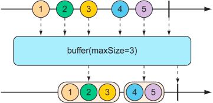

```java
class Test {
    @Test
    public void buffer() {
        Flux<String> fruitFlux = Flux.just(
                "apple", "orange", "banana", "kiwi", "strawberry");
        Flux<List<String>> bufferedFlux = fruitFlux.buffer(3);
        StepVerifier
                .create(bufferedFlux)
                .expectNext(Arrays.asList("apple", "orange", "banana"))
                .expectNext(Arrays.asList("kiwi", "strawberry"))
                .verifyComplete();
        Flux.just(
                        "apple", "orange", "banana", "kiwi", "strawberry")
                .buffer(3)
                .flatMap(x ->
                        Flux.fromIterable(x)
                                .map(y -> y.toUpperCase())
                                .subscribeOn(Schedulers.parallel())
                                .log()
                ).subscribe();
    }
}
```

The collect-list operation results in a `Mono` containing a list of all messages emitted by the incoming `Flux`.
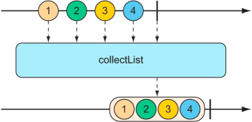

```java
class Test {
    @Test
    public void collectList() {
        Flux<String> fruitFlux = Flux.just(
                "apple", "orange", "banana", "kiwi", "strawberry");
        Mono<List<String>> fruitListMono = fruitFlux.collectList();
        StepVerifier
                .create(fruitListMono)
                .expectNext(Arrays.asList(
                        "apple", "orange", "banana", "kiwi", "strawberry"))
                .verifyComplete();
    }
}
```

The collect-map operation results in a `Mono` containing a Map of messages emitted by the incoming `Flux`, where the key
is derived from some characteristic of the incoming messages.

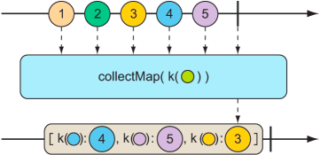

```java
class Test {
    @Test
    public void collectMap() {
        Flux<String> animalFlux = Flux.just(
                "aardvark", "elephant", "koala", "eagle", "kangaroo");
        Mono<Map<Character, String>> animalMapMono =
                animalFlux.collectMap(a -> a.charAt(0));
        StepVerifier
                .create(animalMapMono)
                .expectNextMatches(map -> {
                    return
                            map.size() == 3 &&
                                    map.get('a').equals("aardvark") &&
                                    map.get('e').equals("eagle") &&
                                    map.get('k').equals("kangaroo");
                })
                .verifyComplete();
    }
}
```

### Performing logic operations on reactive types

Sometimes you just need to know if the entries published by a Mono or Flux match some criteria. The `all()` and `any()`
operations perform such logic. Figures 10.21 and 10.22 illustrate how `all()` and `any()` work.

A flux can be tested to ensure that all messages meet some condition with the all operation.
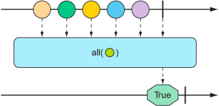

A flux can be tested to ensure that at least one message meets some condition with the any operation.
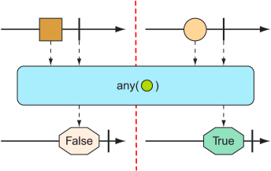

```java
class Test {
    @Test
    public void all() {
        Flux<String> animalFlux = Flux.just(
                "aardvark", "elephant", "koala", "eagle", "kangaroo");

        Mono<Boolean> hasAMono = animalFlux.all(a -> a.contains("a"));
        StepVerifier.create(hasAMono)
                .expectNext(true)
                .verifyComplete();

        Mono<Boolean> hasKMono = animalFlux.all(a -> a.contains("k"));
        StepVerifier.create(hasKMono)
                .expectNext(false)
                .verifyComplete();
    }

    @Test
    public void any() {
        Flux<String> animalFlux = Flux.just(
                "aardvark", "elephant", "koala", "eagle", "kangaroo");

        Mono<Boolean> hasAMono = animalFlux.any(a -> a.contains("a"));

        StepVerifier.create(hasAMono)
                .expectNext(true)
                .verifyComplete();

        Mono<Boolean> hasZMono = animalFlux.any(a -> a.contains("z"));
        StepVerifier.create(hasZMono)
                .expectNext(false)
                .verifyComplete();
    }
}
```

### Summary

- Reactive programming involves creating pipelines through which data flows.
- The Reactive Streams specification defines four types: Publisher, Subscriber, Subscription, and Transformer (which is
  a combination of Publisher and Subscriber).
- Project Reactor implements Reactive Streams and abstracts stream definitions into two primary types, Flux and Mono,
  each of which offers several hundred operations.
- Spring 5 leverages Reactor to create reactive controllers, repositories, REST clients, and other reactive framework
  support.
