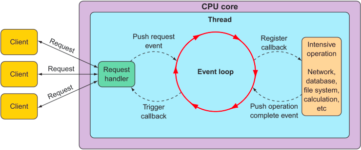
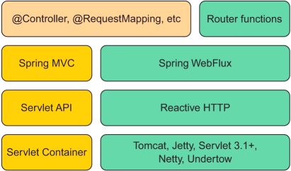
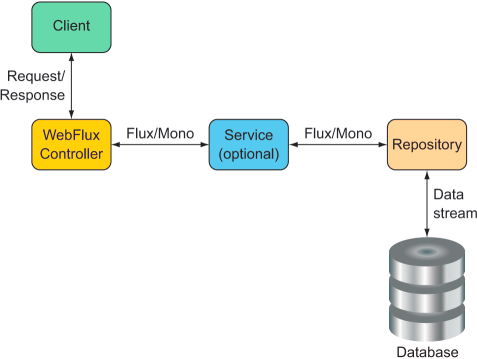

# 11.Developing reactive APIs

> **This chapter covers**
> - Using Spring WebFlux
> - Writing and testing reactive controllers and clients
> - Consuming REST APIs
> - Securing reactive web applications

### Working with Spring WebFlux

Typical Servlet-based web frameworks, such as Spring MVC, are blocking and multi- threaded in nature, using a single
thread per connection. As requests are handled, a worker thread is pulled from a thread pool to process the request.
Meanwhile, the request thread is blocked until it’s notified by the worker thread that it’s finished.

Consequently, blocking web frameworks won’t scale effectively under heavy request volume. Latency in slow worker threads
makes things even worse because it’ll take longer for the worker thread to be returned to the pool, ready to handle
another request. In some use cases, this arrangement is perfectly acceptable. In fact, this is largely how most web
applications have been developed for well over a decade. But times are changing.

The clients of those web applications have grown from people occasionally viewing websites to people frequently
consuming content and using applications that coordinate with HTTP APIs. And these days, the so-called Internet of
Things (where humans aren’t even involved) yields cars, jet engines, and other non-traditional clients constantly
exchanging data with web APIs. With an increasing number of clients consuming web applications, scalability is more
important than ever.

Asynchronous web frameworks, in contrast, achieve higher scalability with fewer threads—generally one per CPU core. By
applying a technique known as event looping (as illustrated in figure 11.1), these frameworks are able to handle many
requests per thread, making the per-connection cost more economical.



#### Introducing Spring WebFlux

As the Spring team was considering how to add a reactive programming model to the web layer, it quickly became apparent
that it would be difficult to do so without a great deal of work in Spring MVC. That would involve branching code to
decide whether to handle requests reactively or not. In essence, the result would be two web frameworks packaged as one,
with if statements to separate the reactive from the non-reactive.

Instead of trying to shoehorn a reactive programming model into Spring MVC, it was decided to create a separate reactive
web framework, borrowing as much from Spring MVC as possible. Spring WebFlux is the result. Figure 11.2 illustrates the
complete web development stack defined by Spring 5.



```xml

<dependency>
    <groupId>org.springframework.boot</groupId>
    <artifactId>spring-boot-starter-webflux</artifactId>
</dependency>
```

An interesting side-effect of using WebFlux instead of Spring MVC is that the default embedded server for WebFlux is
Netty instead of Tomcat. Netty is one of a handful of asynchronous, event-driven servers and is a natural fit for a
reactive web framework like Spring WebFlux.

Aside from using a different starter dependency, Spring `WebFlux` controller methods usually accept and return reactive
types, like `Mono` and `Flux`, instead of domain types and collections. Spring `WebFlux` controllers can also deal with
RxJava types like `Observable`, Single, and `Completable`.

##### REACTIVE SPRING MVC?

Although Spring `WebFlux` controllers typically return `Mono` and `Flux`, that doesn’t mean that Spring MVC doesn’t get
to have some fun with reactive types. Spring MVC controller methods can also return a `Mono` or `Flux`, if you’d like.

#### Writing reactive controllers



```java
class DesignTacoController {
    @GetMapping("/recent")
    public Flux<Taco> recentTacos() {
        return Flux.fromIterable(tacoRepo.findAll()).take(12);
    }
}
```

##### RETURNING SINGLE VALUES

```java
class DesignTacoController {
    @GetMapping("/{id}")
    public Mono<Taco> tacoById(@PathVariable("id") Long id) {
        return tacoRepo.findById(id);
    }
}
```

##### HANDLING INPUT REACTIVELY

```java
class Controller {
    @PostMapping(consumes = "application/json")
    @ResponseStatus(HttpStatus.CREATED)
    public Taco postTaco(@RequestBody Taco taco) {
        return tacoRepo.save(taco);
    }
}
```

### Defining functional request handlers

First, any annotation-based programming involves a split in the definition of what the annotation is supposed to do and
how it’s supposed to do it. Annotations themselves define the what; the how is defined elsewhere in the framework code.
This complicates the programming model when it comes to any sort of customization or extension because such changes
require working in code that’s external to the annotation. Moreover, debugging such code is tricky because you can’t set
a breakpoint on an annotation.

Also, as Spring continues to grow in popularity, developers new to Spring from other languages and frameworks may find
annotation-based Spring MVC (and Web- Flux) quite unlike what they already know. As an alternative to WebFlux, Spring 5
has introduced a new functional programming model for defining reactive APIs.

This new programming model is used more like a library and less like a framework, letting you map requests to handler
code without annotations. Writing an API using Spring’s functional programming model involves four primary types:

- RequestPredicate—Declares the kind(s) of requests that will be handled RouterFunction—Declares how a matching request
  should be routed to handler code
- ServerRequest—Represents an HTTP request, including access to header and body information
- ServerResponse—Represents an HTTP response, including header and body information

As a simple example that pulls all of these types together, consider the following Hello World example:

```java
import static org.springframework.web.
        reactive.function.server.RequestPredicates.GET;
import static org.springframework.web.
        reactive.function.server.RouterFunctions.route;
import static org.springframework.web.
        reactive.function.server.ServerResponse.ok;
import static reactor.core.publisher.Mono.just;

import org.springframework.context.annotation.Bean;
import org.springframework.context.annotation.Configuration;
import org.springframework.web.reactive.function.server.RouterFunction;

@Configuration
public class RouterFunctionConfig {
    @Bean
    public RouterFunction<?> helloRouterFunction() {
        return route(GET("/hello"),
                request -> ok().body(just("Hello World!"), String.class));
    }
}
```

As written, the `helloRouterFunction()` method declares a `RouterFunction` that only handles a single kind of request.
But if you need to handle a different kind of request, you don’t have to write another `@Bean` method, although you can.
You only need to call `andRoute()` to declare another RequestPredicate-to-function mapping. For example, here’s how you
might add another handler for GET requests for /bye:

```java
class Config {
    @Bean
    public RouterFunction<?> helloRouterFunction() {
        return route(GET("/hello"),
                request -> ok().body(just("Hello World!"), String.class))
                .andRoute(GET("/bye"),
                        request -> ok().body(just("See ya!"), String.class));
    }
}
```

To demonstrate how the functional programming model might be used in a real world application, let’s reinvent the
functionality of `DesignTacoController` in the functional style. The following configuration class is a functional
analog to `DesignTacoController`:

```java

@Configuration
public class RouterFunctionConfig {
    @Autowired
    private TacoRepository tacoRepo;

    @Bean
    public RouterFunction<?> routerFunction() {
        return route(GET("/design/taco"), this::recents)
                .andRoute(POST("/design"), this::postTaco);
    }

    public Mono<ServerResponse> recents(ServerRequest request) {
        return ServerResponse.ok()
                .body(tacoRepo.findAll().take(12), Taco.class);
    }

    public Mono<ServerResponse> postTaco(ServerRequest request) {
        Mono<Taco> taco = request.bodyToMono(Taco.class);
        Mono<Taco> savedTaco = tacoRepo.save(taco);
        return ServerResponse
                .created(URI.create(
                        "http://localhost:8080/design/taco/" +
                                savedTaco.getId()))
                .body(savedTaco, Taco.class);
    }
}
```

### Testing reactive controllers

#### Testing GET requests

One thing we’d like to assert about the `recentTacos()` method is that if an HTTP GET request is issued for the path
`/design/recent`, then the response will contain a JSON payload with no more than 12 tacos. The test class in the next
listing is a good start.

```java
package tacos;

import static org.mockito.Mockito.*;

import java.util.ArrayList;
import java.util.List;

import org.junit.Test;
import org.mockito.Mockito;
import org.springframework.http.MediaType;
import org.springframework.test.web.reactive.server.WebTestClient;
import reactor.core.publisher.Flux;
import tacos.Ingredient.Type;
import tacos.data.TacoRepository;
import tacos.web.api.DesignTacoController;

public class DesignTacoControllerTest {
    @Test
    public void shouldReturnRecentTacos() {
        Taco[] tacos = {
                testTaco(1L), testTaco(2L),
                testTaco(3L), testTaco(4L),
                testTaco(5L), testTaco(6L),
                testTaco(7L), testTaco(8L),
                testTaco(9L), testTaco(10L),
                testTaco(11L), testTaco(12L),
                testTaco(13L), testTaco(14L),
                testTaco(15L), testTaco(16L)};
        Flux<Taco> tacoFlux = Flux.just(tacos);


        TacoRepository tacoRepo = Mockito.mock(TacoRepository.class);
        when(tacoRepo.findAll()).thenReturn(tacoFlux);
        WebTestClient testClient = WebTestClient.bindToController(new DesignTacoController(tacoRepo))
                .build();
        testClient.get().uri("/design/recent")
                .exchange()
                .expectStatus().isOk()
                .expectBody()
                .jsonPath("$").isArray()
                .jsonPath("$").isNotEmpty()
                .jsonPath("$[0].id").isEqualTo(tacos[0].getId().toString())
                .jsonPath("$[0].name").isEqualTo("Taco 1").jsonPath("$[1].id")
                .isEqualTo(tacos[1].getId().toString()).jsonPath("$[1].name")
                .isEqualTo("Taco 2").jsonPath("$[11].id")
                .isEqualTo(tacos[11].getId().toString())
                .jsonPath("$[11].name").isEqualTo("Taco 12").jsonPath("$[12]").doesNotExist()
                .jsonPath("$[12]").doesNotExist();

        ClassPathResource recentsResource =
                new ClassPathResource("/tacos/recent-tacos.json");
        String recentsJson = StreamUtils.copyToString(
                recentsResource.getInputStream(), Charset.defaultCharset());
        testClient.get().uri("/design/recent")
                .accept(MediaType.APPLICATION_JSON)
                .exchange()
                .expectStatus().isOk()
                .expectBody()
                .json(recentsJson);
        testClient.get().uri("/design/recent")
                .accept(MediaType.APPLICATION_JSON)
                .exchange()
                .expectStatus().isOk()
                .expectBodyList(Taco.class)
                .contains(Arrays.copyOf(tacos, 12));
    }
}
```

#### Testing POST requests

|  HTTP Method  | WebTestClient method  |
|  ----  | ----  |
| GET | .get() |
| POST | .post() | 
| PUT | .put() |
| PATCH | .patch() | 
| DELETE | .delete() |
| HEAD | .head() |

```java
class Test {
    @Test
    public void shouldSaveATaco() {
        TacoRepository tacoRepo = Mockito.mock(
                TacoRepository.class);
        Mono<Taco> unsavedTacoMono = Mono.just(testTaco(null));
        Taco savedTaco = testTaco(null);
        savedTaco.setId(1L);
        Mono<Taco> savedTacoMono = Mono.just(savedTaco);
        when(tacoRepo.save(any())).thenReturn(savedTacoMono);
        WebTestClient testClient = WebTestClient.bindToController(
                new DesignTacoController(tacoRepo)).build();
        testClient.post().uri("/design")
                .contentType(MediaType.APPLICATION_JSON)
                .body(unsavedTacoMono, Taco.class)
                .exchange()
                .expectStatus().isCreated()
                .expectBody(Taco.class)
                .isEqualTo(savedTaco);
    }

}
```

#### Testing with a live server

The tests you’ve written so far have relied on a mock implementation of the Spring WebFlux framework so that a real
server wouldn’t be necessary. But you may need to test a WebFlux controller in the context of a server like Netty or
Tomcat and maybe with a repository or other dependencies. That is to say, you may want to write an integration test.

To write a `WebTestClient` integration test, you start by annotating the test class with `@RunWith`
and `@SpringBootTest` like any other Spring Boot integration test:

```java

@RunWith(SpringRunner.class)
@SpringBootTest(webEnvironment = WebEnvironment.RANDOM_PORT)
public class DesignTacoControllerWebTest {
    @Autowired
    private WebTestClient testClient;
}
```

```java
class Test {
    @Test
    public void shouldReturnRecentTacos() throws IOException {
        testClient.get().uri("/design/recent")
                .accept(MediaType.APPLICATION_JSON).exchange()
                .expectStatus().isOk()
                .expectBody()
                .jsonPath("$[?(@.id == 'TACO1')].name")
                .isEqualTo("Carnivore")
                .jsonPath("$[?(@.id == 'TACO2')].name")
                .isEqualTo("Bovine Bounty")
                .jsonPath("$[?(@.id == 'TACO3')].name")
                .isEqualTo("Veg-Out");
    }
}
```

You’ve no doubt noticed that this new version of `shouldReturnRecentTacos()` has much less code. There’s no longer any
need to create a `WebTestClient` because you’ll be making use of the autowired instance. And there’s no need to mock
`TacoRepository` because Spring will create an instance of `DesignTacoController` and inject it with a real
`TacoRepository`. In this new version of the test method, you use JSONPath expressions to verify values served from the
database.

### Consuming REST APIs reactively

It would be nice if there was a way to use `RestTemplate` natively with reactive types. Fear not. Spring 5 offers
`WebClient` as a reactive alternative to `RestTemplate`. `WebClient` lets you both send and receive reactive types when
making requests to external APIs.

Using `WebClient` is quite different from using `RestTemplate`. Rather than have several methods to handle different
kinds of requests, `WebClient` has a fluent builder-style interface that lets you describe and send requests. The
general usage pattern for working with WebClient is

- Create an instance of WebClient (or inject a WebClient bean)
- Specify the HTTP method of the request to send
- Specify the URI and any headers that should be in the request
- Submit the request
- Consume the response

#### GETting resources

```java
class Test {
    Mono<Ingredient> ingredient = WebClient.create()
            .get().uri("http://localhost:8080/ingredients/{id}", ingredientId)
            .retrieve()
            .bodyToMono(Ingredient.class);
}
```

```java
class Test {
    Flux<Ingredient> ingredients = WebClient.create()
            .get()
            .uri("http://localhost:8080/ingredients")
            .retrieve()
            .bodyToFlux(Ingredient.class);
}
```

##### MAKING REQUESTS WITH A BASE URI

```java
class Config {
    @Bean
    public WebClient webClient() {
        return WebClient.create("http://localhost:8080");
    }
}
```

```java
class Client {
    @Autowired
    WebClient webClient;

    public Mono<Ingredient> getIngredientById(String ingredientId) {
        Mono<Ingredient> ingredient = webClient
                .get()
                .uri("/ingredients/{id}", ingredientId)
                .retrieve()
                .bodyToMono(Ingredient.class);
    }
}
```

##### TIMING OUT ON LONG-RUNNING REQUESTS

To avoid having your client requests held up by a sluggish network or service, you can use the `timeout()` method from
Flux or Mono to put a limit on how long you’ll wait for data to be published. As an example, consider how you might use
`timeout()` when fetching ingredient data:

```java
class Demo {
    Flux<Ingredient> ingredients = WebClient.create()
            .get()
            .uri("http://localhost:8080/ingredients")
            .retrieve()
            .bodyToFlux(Ingredient.class);
  
        ingredients
                .timeout(Duration.ofSeconds(1))
                .

    subscribe();
}
```

#### Sending resources

```java
class Demo {
    Mono<Ingredient> ingredientMono;
    Mono<Ingredient> result = webClient
            .post()
            .uri("/ingredients")
            .body(ingredientMono, Ingredient.class)
            .retrieve()
            .bodyToMono(Ingredient.class);
}
```

If you don’t have a `Mono` or `Flux` to send, but instead have the raw domain object on hand, you can use `syncBody()`.
For example, suppose that instead of a `Mono<Ingredient>`, you have an Ingredient that you want to send in the request
body:

```java
class Demo {
    Ingedient ingredient;
    Mono<Ingredient> result = webClient
            .post()
            .uri("/ingredients")
            .syncBody(ingredient)
            .retrieve()
            .bodyToMono(Ingredient.class);
}
```

#### Deleting resources

```java
class Demo {
    Mono<Void> result = webClient
            .delete()
            .uri("/ingredients/{id}", ingredientId)
            .retrieve()
            .bodyToMono(Void.class)
            .subscribe();
}
```

#### Handling errors

```java
class Demo {
    Mono<Ingredient> ingredientMono = webClient
            .get()
            .uri("http://localhost:8080/ingredients/{id}", ingredientId)
            .retrieve()
            .bodyToMono(Ingredient.class);
    
    ingredientMono.subscribe(
    ingredient ->

    {
    },
    error->

    {
    });

}
```

```java
class Demo {
    Mono<Ingredient> ingredientMono = webClient
            .get()
            .uri("http://localhost:8080/ingredients/{id}", ingredientId)
            .retrieve()
            .onStatus(HttpStatus::is4xxClientError,
                    response -> Mono.just(new UnknownIngredientException()))
            .bodyToMono(Ingredient.class);
}
```

#### Exchanging requests

Up to this point, you’ve used the `retrieve()` method to signify sending a request when working with `WebClient`. In
those cases, the `retrieve()` method returned an object of type `ResponseSpec`, through which you were able to handle
the response with calls to methods such as `onStatus()`, `bodyToFlux()`, and `bodyToMono()`. Working with `ResponseSpec`
is fine for simple cases, but it’s limited in a few ways. If you need access to the response’s headers or cookie values,
for example, then `ResponseSpec` isn’t going to work for you.

When `ResponseSpec` comes up short, you can try calling `exchange()` instead of `retrieve()`. The `exchange()` method
returns a
`Mono` of type `ClientResponse`, on which you can apply reactive operations to inspect and use data from the entire
response, including the payload, headers, and cookies.

```java
class Demo {
    Mono<Ingredient> ingredientMono = webClient
            .get()
            .uri("http://localhost:8080/ingredients/{id}", ingredientId)
            .exchange()
            .flatMap(cr -> cr.bodyToMono(Ingredient.class));
}
```

Now let’s see what makes `exchange()` different. Let’s suppose that the response from the request might include a header
named `X_UNAVAILABLE` with a value of true to indicate that (for some reason) the ingredient in question is unavailable.
And for the sake of discussion, suppose that if that header exists, you want the resulting Mono to be empty—to not
return anything. You can achieve this scenario by adding another call to `flatMap()` such that the entire `WebClient`
call looks like this:

```java
class Demo {
    Mono<Ingredient> ingredientMono = webClient
            .get()
            .uri("http://localhost:8080/ingredients/{id}", ingredientId)
            .exchange()
            .flatMap(cr -> {
                if (cr.headers().header("X_UNAVAILABLE").contains("true")) {
                    return Mono.empty();
                }
                return Mono.just(cr);
            })
            .flatMap(cr -> cr.bodyToMono(Ingredient.class));
}
```

### Securing reactive web APIs

What’s even more remarkable, though, is that the configuration model for reactive Spring Security isn’t much different
from what you saw in chapter 4. In fact, unlike Spring WebFlux, which has a separate dependency from Spring MVC, Spring
Security comes as the same Spring Boot security starter, regardless of whether you intend to use it to secure a Spring
MVC web application or one written with Spring WebFlux. As a reminder, here’s what the security starter looks like:

```xml

<dependency>
    <groupId>org.springframework.boot</groupId>
    <artifactId>spring-boot-starter-security</artifactId>
</dependency>
```

#### Configuring reactive web security

```java
class Config {
    @Configuration
    @EnableWebFluxSecurity
    public class SecurityConfig {
        @Bean
        public SecurityWebFilterChain securityWebFilterChain(
                ServerHttpSecurity http) {
            return http
                    .authorizeExchange()
                    .pathMatchers("/design", "/orders").hasAuthority("USER")
                    .anyExchange().permitAll()
                    .and()
                    .build();
        }
    }
}
```

#### Configuring a reactive user details service

```java
class Service {
    @Autowired
    UserRepository userRepo;

    @Override
    protected void
    configure(AuthenticationManagerBuilder auth)
            throws Exception {
        auth
                .userDetailsService(new UserDetailsService() {
                    @Override
                    public UserDetails loadUserByUsername(String username)
                            throws UsernameNotFoundException {
                        User user = userRepo.findByUsername(username);
                        if (user == null) {
                            throw new UsernameNotFoundException(
                                    username + "not found");
                        }
                        return user.toUserDetails();
                    }
                });
    }
}
```

### Summary

- Spring WebFlux offers a reactive web framework whose programming model mirrors that of Spring MVC, even sharing many
  of the same annotations.
- Spring 5 also offers a functional programming model as an alternative to Spring WebFlux.
- Reactive controllers can be tested with WebTestClient.
- On the client-side, Spring 5 offers WebClient, a reactive analog to Spring’s RestTemplate.
- Although WebFlux has some significant implications for the underlying mecha- nisms for securing a web application,
  Spring Security 5 supports reactive secu- rity with a programming model that isn’t dramatically different from non-
  reactive Spring MVC applications.