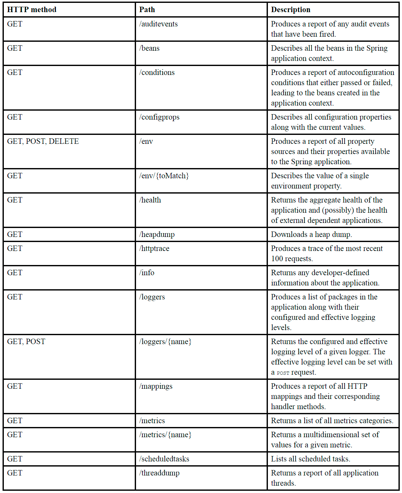

# 16.Working with Spring Boot Actuator

> **This chapter covers**
> - Enabling Actuator in Spring Boot projects - Exploring Actuator endpoints
> - Customizing Actuator
> - Securing Actuator

### Introducing Actuator

Using endpoints exposed by Actuator, we can ask things about the internal state of a running Spring Boot application:

- What configuration properties are available in the application environment? - What are the logging levels of various
  packages in the application?
- How much memory is being consumed by the application?
- How many times has a given HTTP endpoint been requested?
- What is the health of the application and any external services it coordinates with? '

To enable Actuator in a Spring Boot application, you simply need to add Actuator’s starter dependency to your build. In
any Spring Boot application Maven pom.xml file, the following <dependency> entry does the trick:

```xml

<dependency>
    <groupId>org.springframework.boot</groupId>
    <artifactId>spring-boot-starter-actuator</artifactId>
</dependency>
```



### Configuring Actuator’s base path

The Actuator prefix path can be changed by setting the `management.endpoint .web.base-path` property. For example, if
you’d rather the prefix be /management, you would set the management.endpoints.web.base-path property like this:

```yaml
 management:
   endpoints:
     web:
       base-path: /management
```

### Enabling and disabling Actuator endpoints

Two configuration properties, management.endpoints.web.exposure.include and management.endpoints.web.exposure.exclude,
can be used to control which endpoints are exposed. Using management.endpoints.web.exposure.include, you can specify
which endpoints you want to expose. For example, if you wish to expose only the /health, /info, /beans, and /conditions
endpoints, you can specify that with the following configuration:

```yaml
management:
  endpoints:
    web:
      exposure:
        include: health,info,beans,conditions
```

The management.endpoints.web.exposure.include property also accepts an asterisk (*) as a wildcard to indicate that all
Actuator endpoints should be exposed:

```yaml
management:
  endpoints:
    web:
      exposure:
        include: '*'
```

### Summary

- Spring Boot Actuator provides several endpoints, both as HTTP and as JMX MBeans, that let you peek into the inner
  workings of a Spring Boot application.
- Most Actuator endpoints are disabled by default, but can be selectively exposed by setting
  management.endpoints.web.exposure.include and management .endpoints.web.exposure.exclude.
- Some endpoints, such as the /loggers and /env endpoints, allow for write operations to change a running
  application’s configuration on the fly.
- Details regarding an application’s build and Git commit can be exposed in the /info endpoint.
- An application’s health can be influenced by a custom health indicator, track- ing the health of an externally
  integrated application.
- Custom application metrics can be registered through Micrometer, which affords Spring Boot applications instant
  integration with several popular metrics engines such as Datadog, New Relic, and Prometheus.
- Actuator web endpoints can be secured using Spring Security, much like any other endpoint in a Spring web application.


