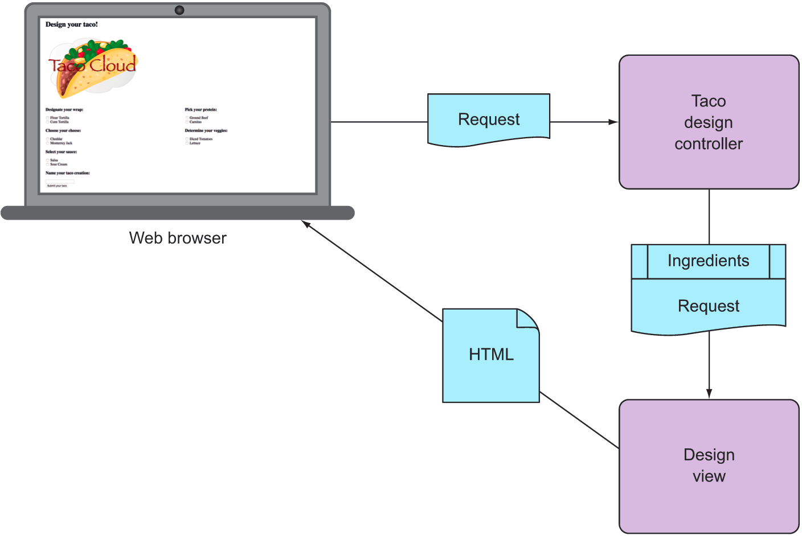

# 2.Developing web applications

> **This chapter covers**
>- <small>Presenting model data in the browser
>- Processing and validating form input
>- Choosing a view template library</samll>



### Declaring validation rules

```java
package tacos;

import java.util.List;
import javax.validation.constraints.NotNull;
import javax.validation.constraints.Size;

import lombok.Data;

@Data
public class Taco {

    @NotNull
    @Size(min = 5, message = "Name must be at least 5 characters long")
    private String name;

    @NotNull
    @Size(min = 1, message = "You must choose at least 1 ingredient")
    private List<Ingredient> ingredients;

}
```

```java
package tacos;

import javax.validation.constraints.Digits;
import javax.validation.constraints.NotBlank;
import javax.validation.constraints.Pattern;

import org.hibernate.validator.constraints.CreditCardNumber;

import java.util.List;
import java.util.ArrayList;

import lombok.Data;

@Data
public class TacoOrder {

    @NotBlank(message = "Delivery name is required")
    private String deliveryName;

    @NotBlank(message = "Street is required")
    private String deliveryStreet;

    @NotBlank(message = "City is required")
    private String deliveryCity;

    @NotBlank(message = "State is required")
    private String deliveryState;

    @NotBlank(message = "Zip code is required")
    private String deliveryZip;

    @CreditCardNumber(message = "Not a valid credit card number")
    private String ccNumber;

    @Pattern(regexp = "^(0[1-9]|1[0-2])([\\/])([1-9][0-9])$",
            message = "Must be formatted MM/YY")
    private String ccExpiration;

    @Digits(integer = 3, fraction = 0, message = "Invalid CVV")
    private String ccCVV;

    private List<Taco> tacos = new ArrayList<>();

    public void addTaco(Taco taco) {
        this.tacos.add(taco);
    }
}
```

```java
@PostMapping
public String processTaco(@Valid @ModelAttribute("taco") Taco taco,Errors errors){
        if(errors.hasErrors()){
        return"design";
        }

        // Save the taco...
        // We'll do this in chapter 3
        log.info("Processing taco: "+taco);

        return"redirect:/orders/current";
        }
```

```html
<label for="ccNumber">Credit Card #: </label>
<input type="text" th:field="*{ccNumber}"/>
<span class="validationError"
      th:if="${#fields.hasErrors('ccNumber')}"
      th:errors="*{ccNumber}">CC Num Error</span>
```

### Choosing a view template library

|  Template   | Spring Boot starter dependency  |
|  ----  | ----  |
| FreeMarker  | spring-boot-starter-freemarker |
| Groovy Templates  | spring-boot-starter-groovy-templates |
| JavaServer Pages (JSP)  | None (provided by Tomcat or Jetty) |
| Mustache  | spring-boot-starter-mustache |
| Thymeleaf  | spring-boot-starter-thymeleaf |

### Caching templates

|  Template   | Cache enable property  |
|  ----  | ----  |
| FreeMarker  | spring.freemarker.cache |
| Groovy Templates  | spring.groovy.template.cache |
| Mustache  | spring.mustache.cache |
| Thymeleaf  | spring.thymeleaf.cache |

All of them value default is true, cache is on.

Using these properties let it off.

```properties
spring.thymeleaf.cache=false
```

### Summary

- Spring offers a powerful web framework called Spring MVC that can be used to develop the web frontend for a Spring
  application.
- Spring MVC is annotation-based, enabling the declaration of request-handling methods with annotations such as
  @RequestMapping, @GetMapping, and @PostMapping.
- Most request-handling methods conclude by returning the logical name of a view, such as a Thymeleaf template, to which
  the request (along with any model data) is forwarded.
- Spring MVC supports validation through the Java Bean Validation API and implementations of the Validation API such as
  Hibernate Validator.
- View controllers can be used to handle HTTP GET requests for which no model data or processing is required.
- In addition to Thymeleaf, Spring supports a variety of view options, including FreeMarker, Groovy Templates, and
  Mustache.