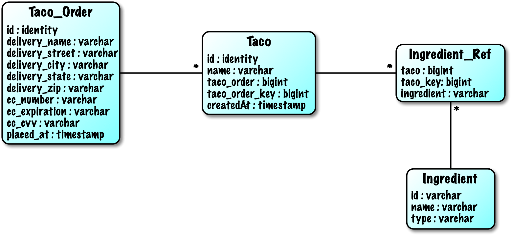
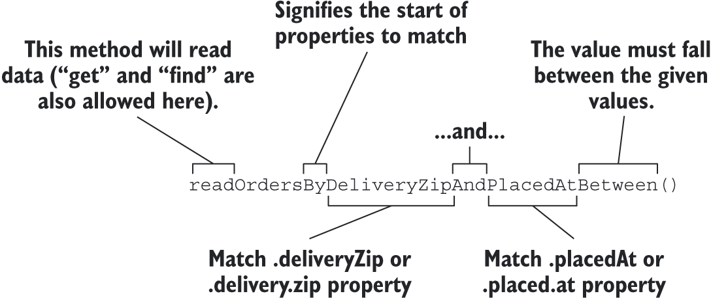

# 3.Working with data

>**This chapter covers**
> - <small>Using Spring’s JdbcTemplate
> - Creating Spring Data JDBC repositories
> - Declaring JPA repositories with Spring Data</small>

### JDBC Template codes
```java
package com.taco.cloud.dao.impl;

import com.taco.cloud.dao.IngredientRepository;
import com.taco.cloud.entity.Ingredient;
import org.springframework.beans.factory.annotation.Autowired;
import org.springframework.jdbc.core.JdbcTemplate;
import org.springframework.stereotype.Repository;

import java.sql.ResultSet;
import java.sql.SQLException;
import java.util.List;
import java.util.Optional;

@Repository
public class JdbcIngredientRepository implements IngredientRepository {

    private JdbcTemplate jdbcTemplate;

    @Autowired
    public JdbcIngredientRepository(JdbcTemplate jdbcTemplate) {
        this.jdbcTemplate = jdbcTemplate;
    }

    @Override
    public List<Ingredient> findAll() {
        return jdbcTemplate.query(
                "select id, name, type from Ingredient",
                this::mapRowToIngredient);
    }


    @Override
    public Optional<Ingredient> findById(String id) {
        List<Ingredient> results = jdbcTemplate.query(
                "select id, name, type from Ingredient where id=?",
                this::mapRowToIngredient,
                id);
        return results.size() == 0 ?
                Optional.empty() :
                Optional.of(results.get(0));
    }

    @Override
    public Ingredient save(Ingredient ingredient) {
        jdbcTemplate.update(
                "insert into Ingredient (id, name, type) values (?, ?, ?)",
                ingredient.getId(),
                ingredient.getName(),
                ingredient.getType().toString());
        return ingredient;
    }

    private Ingredient mapRowToIngredient(ResultSet row, int rowNum)
            throws SQLException {
        return new Ingredient(
                row.getString("id"),
                row.getString("name"),
                Ingredient.Type.valueOf(row.getString("type")));
    }
}

```

### Defining a schema and preloading data


- <kbd>Taco_Order</kbd> — Holds essential order details
- <kbd>Taco</kbd> — Holds essential information about a taco design
- <kbd>Ingredient_Ref</kbd> — Contains one or more rows for each row in Taco, mapping the taco to the ingredients for that taco
- <kbd>Ingredient</kbd> — Holds ingredient information

### Annotating the domain as entities

Entity needs <kbd>@Entity</kbd> and <kbd>@Id</kbd> to make sure is an entity.
<kbd>@GeneratedValue(strategy = GenerationType.AUTO)</kbd> let id type is auto.
```java
 package tacos;
import java.util.ArrayList;
import java.util.Date;
import java.util.List;

import javax.persistence.Entity;
import javax.persistence.GeneratedValue;
import javax.persistence.GenerationType;
import javax.persistence.Id;
import javax.persistence.ManyToMany;
import javax.validation.constraints.NotNull;
import javax.validation.constraints.Size;

import lombok.Data;

@Data
@Entity
public class Taco {

    @Id
    @GeneratedValue(strategy = GenerationType.AUTO)
    private Long id;

    @NotNull
    @Size(min=5, message="Name must be at least 5 characters long")
    private String name;

    private Date createdAt = new Date();

    @Size(min=1, message="You must choose at least 1 ingredient")
    @ManyToMany()
    private List<Ingredient> ingredients = new ArrayList<>();

    public void addIngredient(Ingredient ingredient) {
        this.ingredients.add(ingredient);
    }

}
```

### Declaring JPA repositories

If you want to use a different JPA implementation, then you’ll need to, at least, exclude the Hibernate dependency and include the JPA library of your choice. For example, to use EclipseLink instead of Hibernate, you’ll need to alter the build as follows:
```xml
<dependency>
  <groupId>org.springframework.boot</groupId>
  <artifactId>spring-boot-starter-data-jpa</artifactId>
  <exclusions>
    <exclusion>
        <groupId>org.hibernate</groupId>
        <artifactId>hibernate-core</artifactId>
    </exclusion>
  </exclusions>
</dependency>
<dependency>
  <groupId>org.eclipse.persistence</groupId>
  <artifactId>org.eclipse.persistence.jpa</artifactId>
  <version>2.7.6</version>
</dependency>
```

When you created the JdbcTemplate-based versions of the repositories, you explicitly declared the methods you wanted the repository to provide. But with Spring Data JDBC you were able to dismiss the explicit implementation classes and instead extend the CrudRepository interface. As it turns out, CrudRepository works equally well for Spring Data JPA. For example, here’s the new IngredientRepository interface:

```java
package com.taco.cloud.dao;

import com.taco.cloud.entity.TacoOrder;
import org.springframework.data.repository.CrudRepository;

public interface OrderRepository extends CrudRepository<TacoOrder, Long> {
}
```
In fact, the IngredientRepository interface we’ll use with Spring Data JPA is identical to the one we defined for use with Spring Data JDBC. The CrudRepository interface is commonly used across many of Spring Data’s projects, regardless of the underlying persistence mechanism.

### Customizing repositories

If we need other method except regular CRUD, we just add method like this into your repository.
```java
List<TacoOrder> findByDeliveryZip(String deliveryZip);
```

- <kbd>IsAfter</kbd>, <kbd>After</kbd>, <kbd>IsGreaterThan</kbd>, <kbd>GreaterThan</kbd>
- <kbd>IsGreaterThanEqual</kbd>, <kbd>GreaterThanEqual</kbd>
- <kbd>IsBefore</kbd>, <kbd>Before</kbd>, <kbd>IsLessThan</kbd>, <kbd>LessThan</kbd>
- <kbd>IsLessThanEqual</kbd>, <kbd>LessThanEqual</kbd>
- <kbd>IsBetween</kbd>, <kbd>Between</kbd>
- <kbd>IsNull</kbd>, <kbd>Null</kbd>
- <kbd>IsNotNull</kbd>, <kbd>NotNull</kbd>
- <kbd>IsIn</kbd>, <kbd>In</kbd>
- <kbd>IsNotIn</kbd>, <kbd>NotIn</kbd>
- <kbd>IsStartingWith</kbd>, <kbd>StartingWith</kbd>, <kbd>StartsWith</kbd>
- <kbd>IsEndingWith</kbd>, <kbd>EndingWith</kbd>, <kbd>EndsWith</kbd>
- <kbd>IsContaining</kbd>, <kbd>Containing</kbd>, <kbd>Contains</kbd>
- <kbd>IsLike</kbd>, <kbd>Like</kbd>
- <kbd>IsNotLike</kbd>, <kbd>NotLike</kbd>
- <kbd>IsTrue</kbd>, <kbd>True</kbd>
- <kbd>IsFalse</kbd>, <kbd>False</kbd>
- <kbd>Is</kbd>, <kbd>Equals</kbd>
- <kbd>IsNot</kbd>, <kbd>Not</kbd>
- <kbd>IgnoringCase</kbd>, <kbd>IgnoresCase</kbd>

e.g:
```java
List<TacoOrder> findByDeliveryToAndDeliveryCityAllIgnoresCase(
        String deliveryTo, String deliveryCity);
```
```java
List<TacoOrder> findByDeliveryCityOrderByDeliveryTo(String city);
```
```java
@Query("Order o where o.deliveryCity='Seattle'")
List<TacoOrder> readOrdersDeliveredInSeattle();
``` 

### properties

If we did not set JPA properties it will throw an exception. 

```yaml
spring:
  jpa:
    database: mysql
  datasource:
    generate-unique-name: false
    driver-class-name: org.mariadb.jdbc.Driver
    url: jdbc:mysql://localhost:3306/taco_cloud?serverTimezone=Asia/Shanghai&allowMultiQueries=true&useUnicode=true&characterEncoding=UTF-8&useSSL=false
    username: root
    password: 123456

```

### Summary
- Spring’s <kbd>JdbcTemplate</kbd> greatly simplifies working with JDBC.
- <kbd>PreparedStatementCreator</kbd> and <kbd>KeyHolder</kbd> can be used together when you need to know the value of a database-generated ID.
- Spring Data JPA makes JPA persistence as easy as writing a repository interface.
