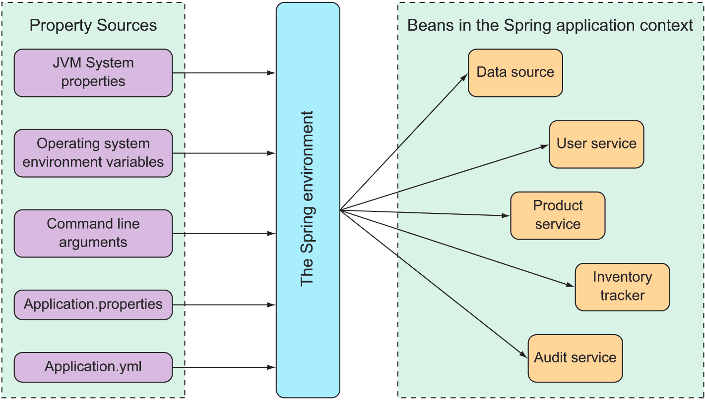

# 4. Working with configuration properties

> **This chapter covers**
> - Fine-tuning autoconfigured beans
> - Applying configuration properties to application components
> - Working with Spring profiles

In some ways, Spring Boot autoconfiguration is like this. Autoconfiguration greatly simplifies Spring application
development. But after a decade of setting property values in Spring XML configuration and calling setter methods on
bean instances, it’s not immediately apparent how to set properties on beans for which there’s no explicit
configuration.

Fortunately, Spring Boot provides a way with configuration properties. Config- uration properties are nothing more than
properties on beans in the Spring 114 Fine-tuning autoconfiguration 115 application context that can be set from one of
several property sources, including JVM system properties, command-line arguments, and environment variables.

### Fine-tuning autoconfiguration

Before we dive in too deeply with configuration properties, it’s important to establish that there are two different (
but related) kinds of configurations in Spring:

- Bean wiring—Configuration that declares application components to be created as beans in the Spring application
  context and how they should be injected into each other.
- Property injection—Configuration that sets values on beans in the Spring application context.

### Understanding Spring’s environment abstraction

The Spring environment abstraction is a one-stop shop for any configurable property. It abstracts the origins of
properties so that beans needing those properties can consume them from Spring itself. The Spring environment pulls from
several property sources, including

- JVM system properties
- Operating system environment variables  Command-line arguments
- Application property configuration files

It then aggregates those properties into a single source from which Spring beans can be injected.


Property in src/main/resources/application.properties like this:

```properties
server.port=9090
```

Server.port value in src/main/ resources/application.yml like this:

```yaml
server:
  port: 9090
```

When starting the application using a command-line argument:

```
$ java -jar tacocloud-0.0.5-SNAPSHOT.jar --server.port=9090
```

As an operating system environment variable:

```
$ export SERVER_PORT=9090
```

### Configuring a data source

```yaml
spring:
  datasource:
    url: jdbc:mysql://localhost/tacocloud
    username: tacodb
    password: tacopassword
    driver-class-name: com.mysql.jdbc.Driver
```

Spring Boot uses this connection data when autoconfiguring the DataSource bean. The DataSource bean will be pooled using
Tomcat’s JDBC connection pool if it’s available on the classpath. If not, Spring Boot looks for and uses one of these
other connection pool implementations on the classpath:

- HikariCP
- Commons DBCP 2

The spring `.datasource.schema` and `spring.datasource.data` properties prove useful:

```yaml
spring:
  datasource:
    schema:
      - order-schema.sql
      - ingredient-schema.sql
      - taco-schema.sql
      - user-schema.sql
    data:
      - ingredients.sql
```

### Configuring the embedded server

```yaml
 server:
   port: 8443
   ssl:
     key-store: file:///path/to/mykeys.jks
     key-store-password: letmein
     key-password: letmein
```

### Configuring logging

To set the logging levels, you create properties that are prefixed with `logging.level`, followed by the name of the
logger for which you want to set the logging level. For instance, suppose you’d like to set the root logging level to
WARN, but log Spring Security logs at a DEBUG level. The following entries in application.yml will take care of that for
you:

```yaml
logging:
  level:
    root: WARN
    org:
      springframework:
        security: DEBUG
```

Optionally, you can collapse the Spring Security package name to a single line for easier reading:

```yaml
logging:
  level:
    root: WARN
    org.springframework.security: DEBUG
```

Now suppose that you want to write the log entries to the file TacoCloud.log at `/var/logs/.` The `logging.path` and
logging.file properties can help achieve that:

```yaml
logging:
  path: /var/logs/
  file: TacoCloud.log
  level:
    root: WARN
    org:
      springframework:
        security: DEBUG
```

Assuming that the application has write permissions to /var/logs/, the log entries will be written to
/var/logs/TacoCloud.log. By default, the log files rotate once they reach 10 MB in size.

### Using special property values

```yaml
greeting:
  welcome: ${spring.application.name}
```

```yaml
greeting:
  welcome: You are using ${spring.application.name}.
```