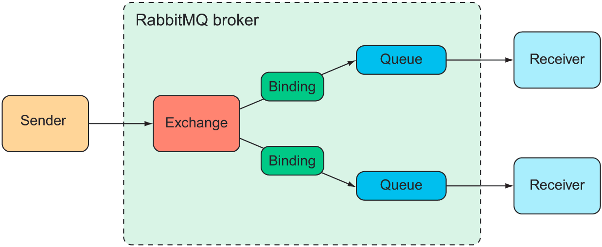
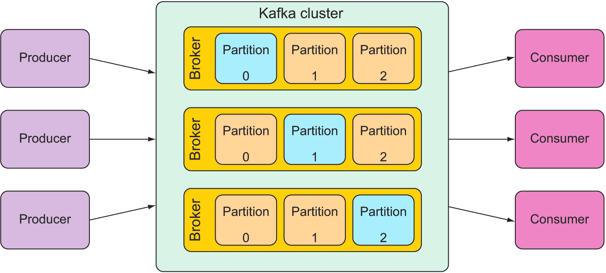

# 8.Sending messages asynchronously

> **This chapter covers**
> - Asynchronous messaging
> - Sending messages with JMS, RabbitMQ, and Kafka
> - Pulling messages from a broker
> - Listening for messages

We’ll consider three options that Spring offers for asyn- chronous messaging: the Java Message Service (JMS), RabbitMQ
and Advanced Mes- sage Queueing Protocol (AMQP), and Apache Kafka. In addition to the basic sending and receiving of
messages, we’ll look at Spring’s support for message-driven POJOs: a way to receive messages that resembles EJB’s
message-driven beans (MDBs).

## Sending messages with JMS

*JMS* is a Java standard that defines a common API for working with message brokers. First introduced in 2001, JMS has
been the go-to approach for asynchronous messaging in Java for a very long time. Before *JMS*, each message broker had a
proprietary API, making an application’s messaging code less portable between brokers. But with JMS, all compliant
implementations can be worked with via a common interface in much the same way that JDBC has given relational database
operations a common interface.

Spring supports *JMS* through a template-based abstraction known as `JmsTemplate`. Using `JmsTemplate`, it’s easy to
send messages across queues and topics from the producer side and to receive those messages on the consumer side. Spring
also supports the notion of message-driven POJOs: simple Java objects that react to messages arriving on a queue or
topic in an asynchronous fashion.

We’re going to explore Spring’s JMS support, including `JmsTemplate` and message- driven POJOs. But before you can send
and receive messages, you need a message broker that’s ready to relay those messages between producers and consumers.
Let’s kick off our exploration of *Spring JMS* by setting up a message broker in Spring.

### Setting up JMS

If you’re using ActiveMQ, you’ll need to add the following dependency to your project’s pom.xml file:

```xml

<dependency>
    <groupId>org.springframework.boot</groupId>
    <artifactId>spring-boot-starter-activemq</artifactId>
</dependency>
```

If ActiveMQ Artemis is the choice, the starter dependency should look like this:

```xml

<dependency>
    <groupId>org.springframework.boot</groupId>
    <artifactId>spring-boot-starter-artemis</artifactId>
</dependency>
```

Properties for configuring the location and credentials of an Artemis broker

```yaml
spring:
  artemis:
    host: artemis.tacocloud.com
    port: 61617
    user: tacoweb
    password: l3tm31n
```

Properties for configuring the location and credentials of an ActiveMQ broker

```yaml
spring:
  activemq:
    broker-url: tcp://activemq.tacocloud.com
    user: tacoweb
    password: l3tm31n
```

If you’re using ActiveMQ, you will, however, need to set the `spring.activemq.in-memory` property to false to prevent
Spring from starting an in-memory broker. An in-memory broker may seem useful, but it’s only helpful when you’ll be
consuming messages from the same application that publishes them (which has limited usefulness). Instead of using an
embedded broker, you’ll want to install and start an Artemis (or ActiveMQ) broker before moving on. Rather than repeat
the installation instructions here, I refer you to the broker documentation for details:

- Artemis—https://activemq.apache.org/artemis/docs/latest/using-server.html
- ActiveMQ—http://activemq.apache.org/getting-started.html#GettingStarted-Pre-
  InstallationRequirements

### Sending messages with JmsTemplate

JmsTemplate has several methods that are useful for sending messages, including the following:

```java
interface JmsTemplate {
    // Send raw messages
    void send(MessageCreator messageCreator) throws JmsException;

    void send(Destination destination, MessageCreator messageCreator)
            throws JmsException;

    void send(String destinationName, MessageCreator messageCreator)
            throws JmsException;

    // Send messages converted from objects
    void convertAndSend(Object message) throws JmsException;

    void convertAndSend(Destination destination, Object message)
            throws JmsException;

    void convertAndSend(String destinationName, Object message)
            throws JmsException;

    // Send messages converted from objects with post-processing
    void convertAndSend(Object message,
                        MessagePostProcessor postProcessor) throws JmsException;

    void convertAndSend(Destination destination, Object message,
                        MessagePostProcessor postProcessor) throws JmsException;

    void convertAndSend(String destinationName, Object message,
                        MessagePostProcessor postProcessor) throws JmsException;
}
```

- Three send() methods require a MessageCreator to manufacture a Message object.
- Three convertAndSend() methods accept an Object and automatically convert that Object into a Message behind the
  scenes.
- Three convertAndSend() methods automatically convert an Object to a Message, but also accept a MessagePostProcessor to
  allow for customization of the Message before it’s sent.

- One method accepts no destination parameter and sends the message to a default destination.
- One method accepts a Destination object that specifies the destination for the message.
- One method accepts a String that specifies the destination for the message by name.

```java

@Service
public class JmsOrderMessagingServiceImpl implements JmsOrderMessagingService {

    @Resource
    private JmsTemplate jmsTemplate;

    @Override
    public void SendMessage(TacoOrder order) {
        jmsTemplate.send(session -> session.createObjectMessage(order));
    }
}
```

But notice that the call to `jms.send()` doesn’t specify a destination. In order for this to work, you must also specify
a default destination name with the `spring.jms.template.default-destination` property. For example, you could set the
property in your application.yml file like this:

```yaml
spring:
  jms:
    template:
      default-destination: tacocloud.order.queue
```

One way of doing that is by passing a Destination object as the first parameter to send(). The easiest way to do this is
to declare a Destination bean and then inject it into the bean that performs messaging. For example, the following bean
declares the Taco Cloud order queue Destination:

```java
class Config {
    @Bean
    public Destination orderQueue() {
        return new ActiveMQQueue("tacocloud.order.queue");
    }
}
```

If this Destination bean is injected into JmsOrderMessagingService, you can use it to specify the destination when
calling send():

```java
class Service {
    @Autowired
    public JmsOrderMessagingService(JmsTemplate jms,
                                    Destination orderQueue) {
        this.jms = jms;
        this.orderQueue = orderQueue;
    }

    @Override
    public void sendOrder(Order order) {
        jms.send(
                orderQueue,
                session -> session.createObjectMessage(order));
    }
}
```

But in practice, you’ll almost never specify anything more than the destination name. It’s often easier to just send the
name as the first parameter to send():

```java
class service {
    @Override
    public void sendOrder(Order order) {
        jms.send(
                "tacocloud.order.queue",
                session -> session.createObjectMessage(order));
    }
}
```

#### CONVERTING MESSAGES BEFORE SENDING

`JmsTemplates’s convertAndSend()` method simplifies message publication by eliminating the need to provide a
`MessageCreator`. Instead, you pass the object that’s to be sent directly to `convertAndSend()`, and the object will be
converted into a Message before being sent. For example, the following reimplementation of `sendOrder()` uses
`convertAndSend()` to send an Order to a named destination:

```java
class Service {
    @Override
    public void sendOrder(Order order) {
        jms.convertAndSend("tacocloud.order.queue", order);
    }
}
```

#### CONFIGURING A MESSAGE CONVERTER

`MessageConverter` is a Spring-defined interface that has only two methods to be implemented:

```java
public interface MessageConverter {
    Message toMessage(Object object, Session session)
            throws JMSException, MessageConversionException;

    Object fromMessage(Message message);
}
```

|Message converter|What it does| 
|----|---- |
|MappingJackson2MessageConverter|Uses the Jackson 2 JSON library to convert messages to and from JSON
|MarshallingMessageConverter|Uses JAXB to convert messages to and from XML
|MessagingMessageConverter|Converts a Message from the messaging abstraction to and from a Message using an underlying Message- Converter for the payload and a JmsHeaderMapper to map the JMS headers to and from standard message headers
|SimpleMessageConverter|Converts Strings to and from TextMessage, byte arrays to and from BytesMessage, Maps to and from MapMessage, and Serializable objects to and from ObjectMessage

To apply a different message converter, all you must do is declare an instance of the chosen converter as a bean. For
example, the following bean declaration will enable MappingJackson2MessageConverter to be used instead of SimpleMessage-
Converter:

```java
class MqConfig {
    @Bean
    public MappingJackson2MessageConverter messageConverter() {
        MappingJackson2MessageConverter messageConverter =
                new MappingJackson2MessageConverter();
        messageConverter.setTypeIdPropertyName("_typeId");
        return messageConverter;
    }
}
```

To allow for more flexibility, you can map a synthetic type name to the actual type by calling setTypeIdMappings() on
the message converter. For example, the Sending messages with JMS 187 following change to the message converter bean
method maps a synthetic order type ID to the Order class:

```java
class MqConfig {
    @Bean
    public MappingJackson2MessageConverter messageConverter() {
        MappingJackson2MessageConverter messageConverter =
                new MappingJackson2MessageConverter();
        messageConverter.setTypeIdPropertyName("_typeId");
        Map<String, Class<?>> typeIdMappings = new HashMap<String, Class<?>>();
        typeIdMappings.put("order", Order.class);
        messageConverter.setTypeIdMappings(typeIdMappings);
        return messageConverter;
    }
}
```

#### POST-PROCESSING MESSAGES

```java
class Send {
    @Resource
    private JmsTemplate jmsTemplate;

    public void send() {
        jms.send("tacocloud.order.queue",
                session -> {
                    Message message = session.createObjectMessage(order);
                    message.setStringProperty("X_ORDER_SOURCE", "WEB");
                });
    }
}
```

```java
class Send {
    @Resource
    private JmsTemplate jmsTemplate;

    public void send() {
        jms.convertAndSend("tacocloud.order.queue", order, new MessagePostProcessor() {
            @Override
            public Message postProcessMessage(Message message) throws JMSException {
                message.setStringProperty("X_ORDER_SOURCE", "WEB");
                return message;
            }
        });
    }
}
```

```java
class Controller {
    @GetMapping("/convertAndSend/order")
    public String convertAndSendOrder() {
        Order order = buildOrder();
        jms.convertAndSend("tacocloud.order.queue", order,
                this::addOrderSource);
        return "Convert and sent order";
    }

    private Message addOrderSource(Message message) throws JMSException {
        message.setStringProperty("X_ORDER_SOURCE", "WEB");
        return message;
    }
}
```

### Receiving JMS messages

When it comes to consuming messages, you have the choice of a _pull model_, where your code requests a message and waits
until one arrives, or a *push model*, in which messages are handed to your code as they become available.

`JmsTemplate`offers several methods for receiving messages, but all of them use a pull model. You call one of those
methods to request a message, and the thread blocks until a message is available (which could be immediately or it might
take a while). On the other hand, you also have the option of using a push model, wherein you define a message listener
that’s invoked any time a message is available.

Both options are suitable for a variety of use cases. It’s generally accepted that the push model is the best choice, as
it doesn’t block a thread. But in some use cases, a listener could be overburdened if messages arrive too quickly. The
pull model enables a consumer to declare that they’re ready to process a new message. Let’s look at both ways of
receiving messages. We’ll start with the pull model offered by
`JmsTemplate`.

#### RECEIVING WITH JMSTEMPLATE

`JmsTemplate` offers several methods for pulling methods from the broker, including the following:

```java
interface Receive {
    Message receive() throws JmsException;

    Message receive(Destination destination) throws JmsException;

    Message receive(String destinationName) throws JmsException;

    Object receiveAndConvert() throws JmsException;

    Object receiveAndConvert(Destination destination) throws JmsException;

    Object receiveAndConvert(String destinationName) throws JmsException;
}
```

```java
package tacos.kitchen.messaging.jms;

import javax.jms.Message;

import org.springframework.beans.factory.annotation.Autowired;
import org.springframework.jms.core.JmsTemplate;
import org.springframework.jms.support.converter.MessageConverter;
import org.springframework.stereotype.Component;

@Component
public class JmsOrderReceiver implements OrderReceiver {
    private JmsTemplate jms;
    private MessageConverter converter;

    @Autowired
    public JmsOrderReceiver(JmsTemplate jms, MessageConverter converter) {
        this.jms = jms;
        this.converter = converter;
    }

    public Order receiveOrder() {
        Message message = jms.receive("tacocloud.order.queue");
        return (Order) converter.fromMessage(message);
    }
}
```

```java

@Component
public class JmsOrderReceiver implements OrderReceiver {
    private JmsTemplate jms;

    @Autowired
    public JmsOrderReceiver(JmsTemplate jms) {
        this.jms = jms;
    }

    public Order receiveOrder() {
        return (Order) jms.receiveAndConvert("tacocloud.order.queue");
    }
}
```

#### DECLARING MESSAGE LISTENERS

```java

@Component
public class OrderListener {
    private KitchenUI ui;

    @Autowired
    public OrderListener(KitchenUI ui) {
        this.ui = ui;
    }

    @JmsListener(destination = "tacocloud.order.queue")
    public void receiveOrder(Order order) {
        ui.displayOrder(order);
    }
}
```

## Working with RabbitMQ and AMQP

As arguably the most prominent implementation of AMQP, RabbitMQ offers a more advanced message-routing strategy than
JMS. Whereas JMS messages are addressed with the name of a destination from which the receiver will retrieve them, AMQP
mes- sages are addressed with the name of an exchange and a routing key, which are decoupled from the queue that the
receiver is listening to. This relationship between a n exchange and queues is illustrated in picture.


When a message arrives at the RabbitMQ broker, it goes to the exchange for which it was addressed. The exchange is
responsible for routing it to one or more queues, depending on the type of exchange, the binding between the exchange
and queues, and the value of the message’s routing key.

There are several different kinds of exchanges, including the following:

- Default—A special exchange that’s automatically created by the broker. It routes messages to queues whose name is the
  same as the message’s routing key. All queues will automatically be bound to the default exchange.
- Direct—Routes messages to a queue whose binding key is the same as the mes- sage’s routing key.
- Topic—Routes a message to one or more queues where the binding key (which may contain wildcards) matches the message’s
  routing key.
- Fanout—Routes messages to all bound queues without regard for binding keys or routing keys.
- Headers—Similar to a topic exchange, except that routing is based on message header values rather than routing keys.
- Dead letter—A catch-all for any messages that are undeliverable (meaning they don’t match any defined
  exchange-to-queue binding).

The simplest forms of exchanges are default and fanout, as these roughly correspond to a JMS queue and topic. But the
other exchanges allow you to define more flexible routing schemes.

The most important thing to understand is that messages are sent to exchanges with routing keys and they’re consumed
from queues. How they get from an exchange to a queue depends on the binding definitions and what best suits your use
cases.

Which exchange type you use and how you define the bindings from exchanges to queues has little bearing on how messages
are sent and received in your Spring appli- cations. Therefore we’ll focus on how to write code that sends and receives
messages with Rabbit.

### Adding RabbitMQ to Spring

```xml

<dependency>
    <groupId>org.springframework.boot</groupId>
    <artifactId>spring-boot-starter-amqp</artifactId>
</dependency>
```

|Property| Description
|----|----
|spring.rabbitmq.addresses|A comma-separated list of RabbitMQ broker addresses
|spring.rabbitmq.host|The broker’s host (defaults to localhost)
|spring.rabbitmq.port|The broker’s port (defaults to 5672)
|spring.rabbitmq.username|The username to use to access the broker (optional)
|spring.rabbitmq.password| The password to use to access the broke

```yaml
spring:
  profiles: prod
  rabbitmq:
    host: rabbit.tacocloud.com
    port: 5673
    username: tacoweb
    password: l3tm31n
```

### Sending messages with RabbitTemplate

At the core of Spring’s support for RabbitMQ messaging is RabbitTemplate. Rabbit- Template is similar to JmsTemplate,
offering a similar set of methods. As you’ll see, however, there are some subtle differences that align with the unique
way that RabbitMQ works.

```java
interface RabbitTemplate {
    // Send raw messages
    void send(Message message) throws AmqpException;

    void send(String routingKey, Message message) throws AmqpException;

    void send(String exchange, String routingKey, Message message)
            throws AmqpException;

    // Send messages converted from objects
    void convertAndSend(Object message) throws AmqpException;

    void convertAndSend(String routingKey, Object message)
            throws AmqpException;

    void convertAndSend(String exchange, String routingKey,
                        Object message) throws AmqpException;

    // Send messages converted from objects with post-processing
    void convertAndSend(Object message, MessagePostProcessor mPP)
            throws AmqpException;

    void convertAndSend(String routingKey, Object message,
                        MessagePostProcessor messagePostProcessor)
            throws AmqpException;

    void convertAndSend(String exchange, String routingKey,
                        Object message,
                        MessagePostProcessor messagePostProcessor)
            throws AmqpException;

}
```

```java
package tacos.messaging;

import org.springframework.amqp.core.Message;
import org.springframework.amqp.core.MessageProperties;
import org.springframework.amqp.rabbit.core.RabbitTemplate;
import org.springframework.amqp.support.converter.MessageConverter;
import org.springframework.beans.factory.annotation.Autowired;
import org.springframework.stereotype.Service;
import tacos.Order;

@Service
public class RabbitOrderMessagingService
        implements OrderMessagingService {
    private RabbitTemplate rabbit;

    @Autowired
    public RabbitOrderMessagingService(RabbitTemplate rabbit) {
        this.rabbit = rabbit;
    }

    public void sendOrder(Order order) {
        MessageConverter converter = rabbit.getMessageConverter();
        MessageProperties props = new MessageProperties();
        Message message = converter.toMessage(order, props);
        rabbit.send("tacocloud.order", message);
    }
}
```

You can override these defaults by setting the `spring.rabbitmq.template.exchange`
and `spring.rabbitmq.template .routing-key` properties:

```yaml
 spring:
   rabbitmq:
     template:
       exchange: tacocloud.orders
       routing-key: kitchens.central
```

#### CONFIGURING A MESSAGE CONVERTER

By default, message conversion is performed with `SimpleMessageConverter`, which is able to convert simple types (like
String) and Serializable objects to Message objects. But Spring offers several message converters for RabbitTemplate,
including the following:

- Jackson2JsonMessageConverter—Converts objects to and from JSON using the Jackson 2 JSON processor
- MarshallingMessageConverter—Converts using a Spring Marshaller and Unmarshaller
- SerializerMessageConverter—Converts String and native objects of any kind using Spring’s Serializer and Deserializer
  abstractions
- SimpleMessageConverter—Converts String, byte arrays, and Serializable types
- ContentTypeDelegatingMessageConverter—Delegates to another `MessageConverter` based on the contentType header
- MessagingMessageConverter—Delegates to an underlying MessageConverter for the message conversion and to an
  AmqpHeaderConverter for the headers

you can configure a Jackson2JsonMessageConverter like this:

```java
class Config {
    @Bean
    public MessageConverter messageConverter() {
        return new Jackson2JsonMessageConverter();
    }
}
```

Spring Boot autoconfiguration will discover this bean and inject it into `RabbitTemplate` in place of the default
message converter.

#### SETTING MESSAGE PROPERTIE

As with JMS, you may need to set some headers in the messages you send. For example, let’s say you need to send an
`X_ORDER_SOURCE` for all orders submitted through the Taco Cloud website. When creating your own Message objects, you
can set the header through the `MessageProperties` instance you give to the message converter. Revisiting
the `sendOrder()`
method from listing 8.5, you only need one additional line of code to set the header:

```java
class Service {
    public void sendOrder(Order order) {
        MessageConverter converter = rabbit.getMessageConverter();
        MessageProperties props = new MessageProperties();
        props.setHeader("X_ORDER_SOURCE", "WEB");
        Message message = converter.toMessage(order, props);
        rabbit.send("tacocloud.order", message);
    }
}
```

When using `convertAndSend()`, however, you don’t have quick access to the `MessageProperties` object.
A `MessagePostProcessor` can help you with that, though:

```java
class Service {
    @Override
    public void sendOrder(Order order) {
        rabbit.convertAndSend("tacocloud.order.queue", order,
                new MessagePostProcessor() {
                    @Override
                    public Message postProcessMessage(Message message)
                            throws AmqpException {
                        MessageProperties props = message.getMessageProperties();
                        props.setHeader("X_ORDER_SOURCE", "WEB");
                        return message;
                    }
                });
    }
}
```

### Receiving message from RabbitMQ

You’ve seen that sending messages with `RabbitTemplate` doesn’t differ much from sending messages with `JmsTemplate`.
And as it turns out, receiving messages from a `RabbitMQ` queue isn’t very different than from JMS. As with JMS, you
have two choices:

- Pulling messages from a queue with RabbitTemplate
- Having messages pushed to a @RabbitListener-annotated method

#### RECEIVING MESSAGES WITH RABBITTEMPLATE

```java
class Receive {
    // Receive messages
    Message receive() throws AmqpException;

    Message receive(String queueName) throws AmqpException;

    Message receive(long timeoutMillis) throws AmqpException;

    Message receive(String queueName, long timeoutMillis) throws AmqpException;

    // Receive objects converted from messages
    Object receiveAndConvert() throws AmqpException;

    Object receiveAndConvert(String queueName) throws AmqpException;

    Object receiveAndConvert(long timeoutMillis) throws AmqpException;

    Object receiveAndConvert(String queueName, long timeoutMillis) throws
            AmqpException;

    // Receive type-safe objects converted from messages
    <T> T receiveAndConvert(ParameterizedTypeReference<T> type) throws
            AmqpException;

    <T> T receiveAndConvert(String queueName, ParameterizedTypeReference<T> type)
            throws AmqpException;

    <T> T receiveAndConvert(long timeoutMillis, ParameterizedTypeReference<T>
            type) throws AmqpException;

    <T> T receiveAndConvert(String queueName, long timeoutMillis,
                            ParameterizedTypeReference<T> type)
            throws AmqpException;
}
```

```java
package tacos.kitchen.messaging.rabbit;

import org.springframework.amqp.core.Message;
import org.springframework.amqp.rabbit.core.RabbitTemplate;
import org.springframework.amqp.support.converter.MessageConverter;
import org.springframework.beans.factory.annotation.Autowired;
import org.springframework.stereotype.Component;

@Component
public class RabbitOrderReceiver {
    private RabbitTemplate rabbit;
    private MessageConverter converter;

    @Autowired
    public RabbitOrderReceiver(RabbitTemplate rabbit) {
        this.rabbit = rabbit;
        this.converter = rabbit.getMessageConverter();
    }

    public Order receiveOrder() {
        Message message = rabbit.receive("tacocloud.orders");
        return message != null
    }
}
```

Depending on the use case, you may be able to tolerate a small delay. In the Taco Cloud kitchen’s overhead display, for
example, you can possibly wait a while if no orders are available. Let’s say you decide to wait up to 30 seconds before
giving up. Then the receiveOrder() method can be changed to pass a 30,000 millisecond delay to receive():

```java
class Receive {
    public Order receiveOrder() {
        Message message = rabbit.receive("tacocloud.order.queue", 30000);
        return message != null
                ? (Order) converter.fromMessage(message)
                : null;
    }
}
```

simply remove the timeout value in the call to receive() and set it in your configuration with the
`spring.rabbitmq.template.receive-timeout` property:

```yaml
spring:
  rabbitmq:
    template:
      receive-timeout: 30000
```

#### HANDLING RABBITMQ MESSAGES WITH LISTENERS

For message-driven `RabbitMQ` beans, Spring offers RabbitListener, the `RabbitMQ` counterpart to `JmsListener`. To
specify that a method should be invoked when a message arrives in a `RabbitMQ` queue, annotate a bean’s method with
`@RabbitTemplate`.

For example, the following listing shows a `RabbitMQ` implementation of `OrderReceiver` that’s annotated to listen for
order messages rather than to poll for them with `RabbitTemplate`.

```java
package tacos.kitchen.messaging.rabbit.listener;

import org.springframework.amqp.rabbit.annotation.RabbitListener;
import org.springframework.beans.factory.annotation.Autowired;
import org.springframework.stereotype.Component;

@Component
public class OrderListener {
    private KitchenUI ui;

    @Autowired
    public OrderListener(KitchenUI ui) {
        this.ui = ui;
    }

    @RabbitListener(queues = "tacocloud.order.queue")
    public void receiveOrder(Order order) {
        ui.displayOrder(order);
    }
}
```

### Messaging with Kafka

Kafka is designed to run in a cluster, affording great scalability. And by partitioning its topics across all instances
in the cluster, it’s very resilient. Whereas RabbitMQ deals primarily with queues in exchanges, Kafka utilizes topics
only to offer pub/sub messaging.

Kafka topics are replicated across all brokers in the cluster. Each node in the cluster acts as a leader for one or more
topics, being responsible for that topic’s data and replicating it to the other nodes in the cluster.

Going a step further, each topic can be split into multiple partitions. In that case, each node in the cluster is the
leader for one or more partitions of a topic, but not for the entire topic. Responsibility for the topic is split across
all nodes. Figure 8.2 illustrates how this works.



### Setting up Spring for Kafka messaging

```xml

<dependency>
    <groupId>org.springframework.kafka</groupId>
    <artifactId>spring-kafka</artifactId>
</dependency>
```

```yaml
spring:
  kafka:
    bootstrap-servers:
      - kafka.tacocloud.com:9092
```

```yaml
spring:
  kafka:
    bootstrap-servers:
      - kafka.tacocloud.com:9092
      - kafka.tacocloud.com:9093
      - kafka.tacocloud.com:9094
```

### Sending messages with KafkaTemplate

```java
class Kafka {
    ListenableFuture<SendResult<K, V>> send(String topic, V data);

    ListenableFuture<SendResult<K, V>> send(String topic, K key, V data);

    ListenableFuture<SendResult<K, V>> send(String topic,
                                            Integer partition, K key, V data);

    ListenableFuture<SendResult<K, V>> send(String topic,
                                            Integer partition, Long timestamp, K key, V data);

    ListenableFuture<SendResult<K, V>> send(ProducerRecord<K, V> record);

    ListenableFuture<SendResult<K, V>> send(Message<?> message);

    ListenableFuture<SendResult<K, V>> sendDefault(V data);

    ListenableFuture<SendResult<K, V>> sendDefault(K key, V data);

    ListenableFuture<SendResult<K, V>> sendDefault(Integer partition,
                                                   K key, V data);

    ListenableFuture<SendResult<K, V>> sendDefault(Integer partition,
                                                   Long timestamp, K key, V data);
}
```

The first thing you may have noticed is that there are no convertAndSend() methods. That’s because KafkaTemplate is
typed with generics and is able to deal with domain types directly when sending messages. In a way, all of the send()
methods are doing the job of `convertAndSend()`.

You may also have noticed that there are several parameters to `send()` and `sendDefault()` that are quite different
from what you used with JMS and Rabbit. When sending messages in Kafka, you can specify the following parameters to
guide how the message is sent:

- The topic to send the message to (required for send())
- A partition to write the topic to (optional)
- A key to send on the record (optional)
- A timestamp (optional; defaults to System.currentTimeMillis())
- The payload (required)

The topic and payload are the two most important parameters. Partitions and keys have little effect on how you use
KafkaTemplate, aside from being extra information provided as parameters to `send()` and `sendDefault()`. For our
purposes, we’re going to focus on sending the message payload to a given topic and not worry ourselves with partitions
and keys.

```yaml
spring:
  kafka:
    template:
      default-topic: tacocloud.orders.topic
```

###       

The handle() method is annotated with `@KafkaListener` to indicate that it should be invoked when a message arrives in
the topic named tacocloud.orders.topic. As it’s written in listing 8.9, only an Order (the payload) is given to handle()
. But if you need additional metadata from the message, it can also accept a `ConsumerRecord` or `Message` object.

For example, the following implementation of `handle()` accepts a `ConsumerRecord` so that you can log the partition and
timestamp of the message:

```java
class Listener {
    @KafkaListener(topics = "tacocloud.orders.topic")
    public void handle(Order order, ConsumerRecord<Order> record) {
        log.info("Received from partition {} with timestamp {}",
                record.partition(), record.timestamp());
        ui.displayOrder(order);
    }
}
```

Similarly, you could ask for a `Message` instead of a `ConsumerRecord` and achieve the same thing:

```java
class Listener {
    @KafkaListener(topics = "tacocloud.orders.topic")
    public void handle(Order order, Message<Order> message) {
        MessageHeaders headers = message.getHeaders();
        log.info("Received from partition {} with timestamp {}",
                headers.get(KafkaHeaders.RECEIVED_PARTITION_ID)
                headers.get(KafkaHeaders.RECEIVED_TIMESTAMP));
        ui.displayOrder(order);
    }
}
```

It’s worth noting that the message payload is also available via `ConsumerRecord.value()` or `Message.getPayload()`.
This means that you could ask for the `Order` through those objects instead of asking for it directly as a parameter to
`handle()`.

## Summary

- Asynchronous messaging provides a layer of indirection between communicat- ing applications, which allows for looser
  coupling and greater scalability.
- Spring supports asynchronous messaging with JMS, RabbitMQ, or Apache Kafka.
- Applications can use template-based clients (`JmsTemplate`, `RabbitTemplate`, or `KafkaTemplate`) to send messages via a
  message broker.
- Receiving applications can consume messages in a pull-based model using the same template-based clients.
- Messages can also be pushed to consumers by applying message listener annotations (`@JmsListener`, `@RabbitListener`, or
  `@KafkaListener`) to bean methods.