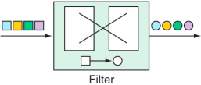

# 9.Integrating Spring

> **This chapter covers**
>- Processing data in real time
>- Defining integration flows
>- Using Spring Integration’s Java DSL definition
>- Integrating with emails, filesystems, and other external systems

### Declaring a simple integration flow

To get your feet wet with Spring Integration, you’re going to create an integration flow that writes data to the
filesystem. To get started, you need to add Spring Integration to your project build. For Maven, the necessary
dependencies are as follows:

```xml

<dependencies>
    <dependency>
        <groupId>org.springframework.boot</groupId>
        <artifactId>spring-boot-starter-integration</artifactId>
    </dependency>
    <dependency>
        <groupId>org.springframework.integration</groupId>
        <artifactId>spring-integration-file</artifactId>
    </dependency>
</dependencies>
```

#### Defining integration flows with XML

```xml
<?xml version="1.0" encoding="UTF-8"?>
<beans xmlns="http://www.springframework.org/schema/beans"
       xmlns:xsi="http://www.w3.org/2001/XMLSchema-instance"
       xmlns:int="http://www.springframework.org/schema/integration"
       xmlns:int-file="http://www.springframework.org/schema/integration/file"
       xsi:schemaLocation="http://www.springframework.org/schema/beans
    http://www.springframework.org/schema/beans/spring-beans.xsd
    http://www.springframework.org/schema/integration
    http://www.springframework.org/schema/integration/spring-integration.xsd
    http://www.springframework.org/schema/integration/file
    http://www.springframework.org/schema/integration/file/spring-
integration-file.xsd">
    <int:channel id="textInChannel"/>
    <int:transformer id="upperCase"
                     input-channel="textInChannel"
                     output-channel="fileWriterChannel"
                     expression="payload.toUpperCase()"/>
    <int:channel id="fileWriterChannel"/>
    <int-file:outbound-channel-adapter id="writer"
                                       channel="fileWriterChannel"
                                       directory="/tmp/sia5/files"
                                       mode="APPEND"
                                       append-new-line="true"/>
</beans>
```

- You configured a channel named textInChannel. You’ll recognize this as the same channel that’s set as the request
  channel for FileWriterGateway. When the writeToFile() method is called on FileWriterGateway, the resulting mes- sage
  is published to this channel.
- You configured a transformer that receives messages from textInChannel. It uses a Spring Expression Language (SpEL)
  expression to call toUpperCase() on the message payload. The result of the uppercase operation is then published to
  fileWriterChannel.
- You configured the channel named fileWriterChannel. This channel serves as the conduit that connects the transformer
  with the outbound channel adapter.
- Finally, you configured an outbound channel adapter using the int-file namespace. This XML namespace is provided by
  Spring Integration’s file module to write files. As you configured it, it receives messages from fileWriterChannel and
  writes the message payload to a file whose name is specified in the message’s file_name header in the directory
  specified in the directory attribute. If the file already exists, the file will be appended with a newline rather than
  overwritten.


If you want to use XML configuration in a Spring Boot application, you’ll need to import the XML as a resource into the
Spring application. The easiest way to do this is to use Spring’s `@ImportResource` annotation on one of your
application’s Java configuration classes:

```java

@Configuration
@ImportResource("classpath:/filewriter-config.xml")
public class FileWriterIntegrationConfig {
}
```

#### Configuring integration flows in Java

```java
package sia5;

import java.io.File;

import org.springframework.context.annotation.Bean;
import org.springframework.context.annotation.Configuration;
import org.springframework.integration.annotation.ServiceActivator;
import org.springframework.integration.annotation.Transformer;
import org.springframework.integration.file.FileWritingMessageHandler;

import org.springframework.integration.file.support.FileExistsMode;
import org.springframework.integration.transformer.GenericTransformer;

@Configuration
public class FileWriterIntegrationConfig {
    @Bean
    @Transformer(inputChannel = "textInChannel",
            outputChannel = "fileWriterChannel")
    public GenericTransformer<String, String> upperCaseTransformer() {
        return text -> text.toUpperCase();
    }

    @Bean
    @ServiceActivator(inputChannel = "fileWriterChannel")
    public FileWritingMessageHandler fileWriter() {
        FileWritingMessageHandler handler =
                new FileWritingMessageHandler(new File("/tmp/sia5/files"));
        handler.setExpectReply(false);
        handler.setFileExistsMode(FileExistsMode.APPEND);
        handler.setAppendNewLine(true);
        return handler;
    }
}
```

You’ll also notice that you didn’t need to explicitly declare the channels. The `textInChannel` and `fileWriterChannel`
channels will be created automatically if no beans with those names exist. But if you want more control over how the
channels are con figured, you can explicitly construct them as beans like this:

```java
class Config {
    @Bean
    public MessageChannel textInChannel() {
        return new DirectChannel();
    }

    @Bean
    public MessageChannel fileWriterChannel() {
        return new DirectChannel();
    }
}
```

#### Using Spring Integration’s DSL configuration

```java
 package sia5;

import java.io.File;

import org.springframework.context.annotation.Bean;
import org.springframework.context.annotation.Configuration;
import org.springframework.integration.dsl.IntegrationFlow;
import org.springframework.integration.dsl.IntegrationFlows;
import org.springframework.integration.dsl.channel.MessageChannels;
import org.springframework.integration.file.dsl.Files;
import org.springframework.integration.file.support.FileExistsMode;

@Configuration
public class FileWriterIntegrationConfig {
    @Bean
    public IntegrationFlow fileWriterFlow() {
        return IntegrationFlows
                .from(MessageChannels.direct("textInChannel"))
                .<String, String>transform(t -> t.toUpperCase())
                .handle(Files.outboundAdapter(new File("/tmp/sia5/files"))
                        .fileExistsMode(FileExistsMode.APPEND)
                        .appendNewLine(true))
                .get();
    }
}
```

### Surveying the Spring Integration landscape

An integration flow is composed of one or more of the following components. Before you write any more code, we’ll take a
brief look at the role each of these components plays in an integration flow:

- Channels—Pass messages from one element to another.
- Filters—Conditionally allow messages to pass through the flow based on some criteria.
- Transformers—Change message values and/or convert message payloads from one type to another.
- Routers—Direct messages to one of several channels, typically based on message headers.
- Splitters—Split incoming messages into two or more messages, each sent to different channels.
- Aggregators—The opposite of splitters, combining multiple messages coming in from separate channels into a single
  message.
- Service activators—Hand a message off to some Java method for processing, and then publish the return value on an
  output channel.
- Channel adapters—Connect a channel to some external system or transport. Can either accept input or write to the
  external system.
- Gateways—Pass data into an integration flow via an interface.

#### Message channels

Message channels are the means by which messages move through an integration pipeline (figure 9.2). They’re the pipes
that connect all the other parts of Spring Integration plumbing together.


Spring Integration provides several channel implementations, including these:

- PublishSubscribeChannel — Messages published into a PublishSubscribeChannel are passed on to one or more consumers. If
  there are multiple consumers, all of them receive the message.
- QueueChannel — Messages published into a QueueChannel are stored in a queue until pulled by a consumer in a first in,
  first out (FIFO) fashion. If there are multiple consumers, only one of them receives the message.
- PriorityChannel — Like QueueChannel but, rather than FIFO behavior, messages are pulled by consumers based on the
  message priority header.
- RendezvousChannel — Like QueueChannel except that the sender blocks the channel until a consumer receives the message,
  effectively synchronizing the sender with the consumer.
- DirectChannel — Like PublishSubscribeChannel but sends a message to a single consumer by invoking the consumer in the
  same thread as the sender. This allows for transactions to span across the channel.
- ExecutorChannel — Similar to DirectChannel but the message dispatch occurs via a TaskExecutor, taking place in a
  separate thread from the sender. This channel type doesn’t support transactions that span the channel.
- FluxMessageChannel — A Reactive Streams Publisher message channel based on Project Reactor’s Flux. (We’ll talk more
  about Reactive Streams, Reactor, and Flux in chapter 12.)

In both the Java configuration and Java DSL styles, input channels are automatically created, with `DirectChannel` as
the default. But if you want to use a different channel implementation, you’ll need to explicitly declare the channel as
a bean and reference it in the integration flow. For example, to declare a `PublishSubscribeChannel`, you’d declare the
following `@Bean` method:

```java
class Config {
    @Bean
    public MessageChannel orderChannel() {
        return new PublishSubscribeChannel();
    }
}
```

In both the Java configuration and Java DSL styles, input channels are automatically created, with `DirectChannel` as
the default. But if you want to use a different channel implementation, you’ll need to explicitly declare the channel as
a bean and reference it in the integration flow. For example, to declare a `PublishSubscribeChannel`, you’d declare the
following `@Bean` method:

```java
class Config {
    @Bean
    public MessageChannel orderChannel() {
        return new PublishSubscribeChannel();
    }
}
```

It’s important to note that if you’re using `QueueChannel`, the consumers must be configured with a poller. For
instance, suppose that you’ve declared a `QueueChannel` bean like this:

```java
class Config {
    @Bean
    public MessageChannel orderChannel() {
        return new QueueChannel();
    }
}
```

You’d need to make sure that the consumer is configured to poll the channel for messages. In the case of a service
activator, the `@ServiceActivator` annotation might look like this:

```java

@ServiceActivator(inputChannel = "orderChannel",
        poller = @Poller(fixedRate = "1000"))
```

In this example, the service activator polls from the channel named orderChannel every 1 second (or 1,000 ms).

### Filters

Filters can be placed in the midst of an integration pipeline to allow or disallow messages from proceeding to the next
step in the flow (figure 9.3).

Filters based on some criteria allow or disallow messages from proceeding in the pipeline.


For example, suppose that messages containing integer values are published through a channel named numberChannel, but
you only want even numbers to pass on to the channel named evenNumberChannel. In that case, you could declare a filter
with the `@Filter` annotation like this:

```java
class Config {
    @Filter(inputChannel = "numberChannel",
            outputChannel = "evenNumberChannel")
    public boolean evenNumberFilter(Integer number) {
        return number % 2 == 0;
    }
}
```

### Transformers

Transformers morph messages as they flow through an integration flow.


```java
class Config {
    @Bean
    @Transformer(inputChannel = "numberChannel",
            outputChannel = "romanNumberChannel")
    public GenericTransformer<Integer, String> romanNumTransformer() {
        return RomanNumbers::toRoman;
    }
}
```

```java
class Config {
    @Bean
    public IntegrationFlow transformerFlow() {
        return IntegrationFlows
                .transform(RomanNumbers::toRoman)
                .get();
    }
}
```

### Routers

Routers direct messages to different channels, based on some criteria applied to the
messages.

```java
class Config {
    @Bean
    @Router(inputChannel = "numberChannel")
    public AbstractMessageRouter evenOddRouter() {
        return new AbstractMessageRouter() {
            @Override
            protected Collection<MessageChannel>
            determineTargetChannels(Message<?> message) {
                Integer number = (Integer) message.getPayload();
                if (number % 2 == 0) {
                    return Collections.singleton(evenChannel());
                }
                return Collections.singleton(oddChannel());
            }
        };
    }

    @Bean
    public MessageChannel evenChannel() {
        return new DirectChannel();
    }

    @Bean
    public MessageChannel oddChannel() {
        return new DirectChannel();
    }
}
```

```java
class Config {
    @Bean
    public IntegrationFlow numberRoutingFlow(AtomicInteger source) {
        return IntegrationFlows
                .<Integer, String>route(n -> n % 2 == 0 ? "EVEN" : "ODD", mapping -> mapping
                        .subFlowMapping("EVEN", sf -> sf
                                .<Integer, Integer>transform(n -> n * 10)
                                .handle((i, h) -> {
                                })
                        )
                        .subFlowMapping("ODD", sf -> sf
                                .transform(RomanNumbers::toRoman)
                                .handle((i, h) -> {
                                })
                        )
                ).get();
    }
}
```

### Splitters

Splitters break down messages into two or more separate messages that can be handled by separate
subflows.

- Splitters are useful in many circumstances, but there are two essential use cases for which you might use a splitter:
  A message payload contains a collection of items of the same type that you’d like to process as individual message
  payloads. For example, a message carrying a list of products might be split into multiple messages with payloads of
  one product each.
- A message payload carries information that, although related, can be split into two or more messages of different
  types. For example, a purchase order might carry delivery, billing, and line-item information. The delivery details
  might be processed by one subflow, billing by another, and line items in yet another. In this use case, the splitter
  is typically followed by a router that routes messages by payload type to ensure that the data gets handled by the
  right subflow.

```java
public class OrderSplitter {
    public Collection<Object> splitOrderIntoParts(PurchaseOrder po) {
        ArrayList<Object> parts = new ArrayList<>();
        parts.add(po.getBillingInfo());
        parts.add(po.getLineItems());
        return parts;
    }
}
```